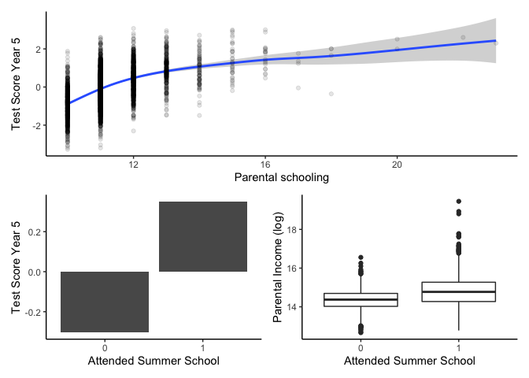
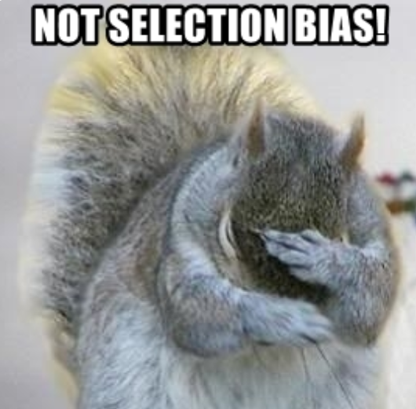
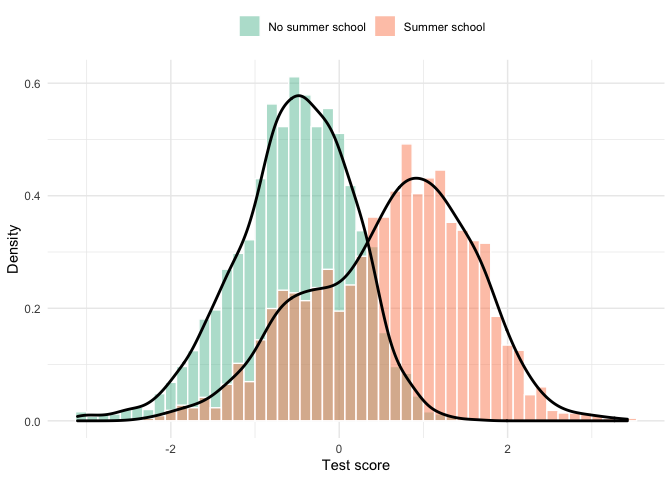

# Welcome!

### Hi!{-}


This tutorial is written for Applied Economics students at the University of Bristol.. 


**How this works**

- The tutorial is structured as a complete research project starting with loading the raw data and ending with a chart comparing the estimates across approaches. 
- All data used is directly downloadable (see the next section). You should therefore be able to download and reproduce all results. 
- The tutorial is mainly consists of code blocks  and the resulting output.  Every now and then I include some references to how I would do the same task in Stata or key differences to Stata. 
- This tutorial is a work in progress project, so please let me know if you find mistakes, a particularly unclear sections, or if you have suggestions for improvements (just send an email to h.h.sievertsen@bristol.ac.uk).
- For source files check the github repository [github.com/hhsievertsen/applied_econ_with_r](https://github.com/hhsievertsen/applied_econ_with_r).


I appreciate feedback, thanks.

Hans  (version 0.3 - November 30 , 2020)


<br><br><br><br><br><br>

# 1 Research Question  & Data


## 1.1 Research Question

Throughout this tutorial our empirical objective is to answer the following **fictitious** research question:
  
> Does attending a summer school improve test scores?
  
The research question will be addressed using a **fictitious simulated** dataset. 

## 1.2 The fictitious setting

The research question is inspired by papers such as [Matsudaira (2007)](https://www.sciencedirect.com/science/article/pii/S0304407607001194?casa_token=hnnF764CKPoAAAAA:5b9WhCManNDsdW4SmOHnnzNr0fZIarW8s6EsvpQW7MdUt470eNPmN2T8IFCsNc6Iajew5tEeNA) and the survey on interventions low SES students by  by [Dietrichson et al ( 2017)](https://journals.sagepub.com/doi/abs/10.3102/0034654316687036). 

The  **fictitious** setting is as follows:
  
  - In the summer break between year 5 and year 6, (corresponding to age 10) there is an optional summer school (or academic summer camp). 

- The  summer school  could be focusing on the school curriculum, or it could be focused on skills that lead to improved schooling outcomes (for example "grit" as in [Alan et al (2019)](https://academic.oup.com/qje/article-abstract/134/3/1121/5342089?redirectedFrom=fulltext)).

- The summer school is free, but enrollment requires actively involvement by parents.

- We are interested in whether participation in the summer school improves child outcomes. 

- The setting is a dream for  researchers (there is a reason why it is **fictitious**!):
  
* There was a Randomised Controlled Trial (*RCT*), where some families were randomised into receiving a letter reminding them of the summer school. We will exploit this for  **hypothesis testing**,  **regressions**, and applying an **instrumental variables** approach.

* We have test score measures before and treatment allowing us to test the effect of the summer school in a **difference-in-differences** approach.

* Pupils with test scores below 1.5 in year 5 were encouraged to participate in the summer school. This allows us to address the research question in a **regression discontinuity** approach.


## 1.3  The fictitious data

We have three datasets to study the research question:
  
  1.  [school_data_1.csv](https://raw.githubusercontent.com/hhsievertsen/applied_econ_with_r/main/data/school_data_1.csv) 

- We use this as example on how to **load data stored in a csv format**.
- This dataset contains information about person id, school id, an indicator variable that takes the value of 1 if the individual participated in the summer school, information about gender, parental income and parental schooling, and test scores in year 5 (before the treatment) and year 6. 


2.  [school_data_2.dta](https://github.com/hhsievertsen/applied_econ_with_r/raw/main/data/school_data_2.dta) 

- We use this as example on **how to load data stored in a Stata format**.
- This dataset contains information about person id, which enables us to link it to the first dataset. We will use this to practice **merging** data.
- The dataset also contains information about whether the individual received a reminder letter. 


3.  [school_data_3.xlsx](https://github.com/hhsievertsen/applied_econ_with_r/raw/main/data/school_data_3.xlsx) 

- We use this as example on how to **load data stored in a Microsoft Excel format**.
- This dataset contains information about person id, which enables us to link it to the first dataset. 
- The dataset also contains information about test scores in earlier (<5) and later years (>6).


Let's get started!

<br><br><br><br><br><br>


# 2 Loading & Cleaning the Data

## 2.1 Installing and loading a "package"

The first item on our to do list is to load the datasets. The first dataset is in a csv format. There are several ways to load a csv document into R. I am going to use `read_csv()` from the *readr* package. Before we can use this package we need to install it. We install a package with the `install.packages()` function, where we insert the name of the package in parenthesis. This procedure corresponds to *ssc install outreg* to install outreg in Stata. 

An important difference to Stata is that we also have to tell R to use the new package in every new session. We do that with `library()`. However we only have to install it once. So to install and load *readr* we run the following command:


```r
install.packages("readr")
```

To load the *readr* package we run the following command:


```r
library("readr")
```


## 2.2 Loading a csv data file 

Having installed *readr* we are now ready to use the `read_csv()` function to load our first dataset. We will load the dataset *school_data_1.csv* by inserting the path to the file in the parenthesis: 


```r
# load readr
library("readr")
# load data
read_csv("C:/Users/hhs/school_data_1.csv")
```

Stata users would now expect that the dataset is loaded in the memory and everything I do now relates to this dataset. Stata users will be disappointed. When R executes the command above it loads the data, but then it says: "Hey, Hans didn't tell me what to do with the dataset, so I will just print the contents of it and forget it." 

While Stata (at least in older versions) is based on having one dataset loaded at a time, we can have many datasets loaded at once in R. Therefore, to identify the dataset we need to give it a name. In this example we tell R to store the new dataset under the name *school_data_1* I use the *assignment operator* `<-`, but `=` would also work. However, it is a good habit to use the assignment operator, because it makes life a bit easier once we get to scoping (if we get there). Ignore this for now, and move on.


```r
# load readr
library("readr")
# load data and assign it to an object with the name school_data_1
school_data_1<-read_csv("C:/Users/hhs/school_data_1.csv")
```


Very good! I might ignore `library()` in subsequent code blocks and examples to save space. Once you've started R and you've run the `library()` command once, you don't have to run it again before you close and restart R again.

In Stata my first step after loading the data is typically to use *browse* to take a look at the data. In R we can do that with `View(school_data_1)`. I will not show that command here. Instead I will present the function `head()` that prints the head of the dataset with the first 6 rows. 


```r
# Use head() to print first 6 observations of school_data_1
head(school_data_1)
```

```
## # A tibble: 6 × 8
##   person_id school_id summercamp female parental_schooling parental_lincome
##       <int>     <int>      <dbl>  <dbl>              <dbl>            <dbl>
## 1         1         5          0      1                 10             12.9
## 2         2        14          1      0                 11             14.7
## 3         3         7          1      0                 14             16.1
## 4         4         8          0      0                 12             14.6
## 5         5         9          1      0                 11             13.8
## 6         6        26          1      1                 11             14.7
## # … with 2 more variables: test_year_5 <dbl>, test_year_6 <dbl>
```


## 2.3 Loading a Stata data file 

We will now load a Stata dataset into R. To load a *dta* file I will use the  `read.dta13()` function from the *readstata13* package. The syntax is then very similar to the `read_csv()` syntax. This time we will use `tail()` to show the last 8 observations.


```r
# load readstata13
library("readstata13")
# use read.dta13 from readstata13 to load a Stata dataset
school_data_2<- read.dta13("C:/Users/hhs/school_data_2.dta")
# print the tail
tail(school_data_2,n=8)
```

```
## # A tibble: 8 × 2
##   person_id letter
##       <int>  <dbl>
## 1      3484      0
## 2      3485      0
## 3      3486      1
## 4      3487      0
## 5      3488      1
## 6      3489      0
## 7      3490      0
## 8      3491      0
```


  
## 2.4 Loading an xlsx file

Finally, we'll load the the *xlsx* file *school_data_3.xlsx* for that we'll use the `read.xlsx()` function from the *openxlsx* package. Again, the syntax is very similar to what we've seen before.  This time we will use the `glimpse()` function from the *dplyr* package to get a glimpse of the dataset. 


```r
# Load openxlsx and dplyr
library("openxlsx")
library("dplyr")
# Use read.xlsx from openxlsx to load .xlsx file
school_data_3 <- read.xlsx("C:/Users/hhs/school_data_3.xlsx")
# use glimpse to get a "glimpse" of the loaded dataset
glimpse(school_data_3)
```

```
## Rows: 3,491
## Columns: 10
## $ person_id    <int> 1, 2, 3, 4, 5, 6, 7, 8, 9, 10, 11, 12, 13, 14, 15, 16, 17…
## $ test_year_2  <dbl> 1.090117, 1.246309, 2.726472, 2.693032, 1.660545, 2.22377…
## $ test_year_3  <dbl> 1.914594, 1.154470, 2.269011, 2.413203, 1.828067, 2.27566…
## $ test_year_4  <dbl> 2.065805, 1.582455, 3.247252, 1.479452, 1.361972, 2.38510…
## $ test_year_7  <dbl> 2.377697, 1.747376, 3.017764, 2.637954, 1.904636, 3.37613…
## $ test_year_8  <dbl> 2.032904, 2.444041, 3.361646, 3.021940, 2.109774, 3.24542…
## $ test_year_9  <dbl> 1.493803, 1.663050, 3.387020, 2.761513, 2.285818, 2.96503…
## $ test_year_10 <dbl> 1.880512, 1.833769, 2.968617, 2.088086, 1.845694, 3.30819…
## $ learnings    <dbl> 10.236394, 8.278911, 8.966529, 8.876466, 8.770518, 10.484…
## $ school_id    <int> 5, 14, 7, 8, 9, 26, 13, 11, 23, 9, 25, 15, 3, 4, 17, 7, 1…
```


## 2.5 Merging the datasets

Let's now load the three datasets. We will use the `merge()` function for that. The function `merge()` is included in  *base* R. We therefore do not need to install and load any packages to use it. In merge we first state the names of the two datasets to merge. We then tell R the column(s) to use to merge the two datasets with `by=....`. As a default R includes all rows that are observed in both datasets (based on the by variable), but we can  set `all=TRUE` to keep all rows from both datasets, or `all.x=TRUE` to keep all rows from the first dataset and all rows that were merged, and finally `all.y=TRUE` to keep all rows from the second dataset. The default behaviour of R corresponds to using the option *keep(3)* in Stata, and Stata's default option corresponds to using `all=TRUE` in R. 

**Important difference to Stata:** A key difference between Stata and R merge is that in case a variable in the first dataset has the same name as a column in the second dataset, R will automatically rename the column names by adding suffices *.x* (the column from the first dataset) and *.y*  (the column from the second dataset). Stata just overwrites the columns. 

In the code block below we

1. Load the dataset *school_data_1.csv* as described above.
2. Load the dataset *school_data_2.dta* as described above.
3. Load the dataset *school_data_3.xlsx* as described above.
4. Merge *school_data_1* and *school_data_2* by the *person_id* column and save the merged dataset under the name *school_data*.
4. Merge *school_data_3* with *school_data* and overwrite *school_data*. Note in this case we merge by *person_id* and *school_id* columns. This is not necessary (because person_id is unique), but serves as an example on how to merge by more columns using `c()`.  name *school_data*.
5. Use the `summary()` function to obtain summary statistics of the variables.


```r
# Merge school_data_1 and school_data_2 and save as school_data_merged 
school_data_merged<-merge(school_data_1,school_data_2,by="person_id")
# Merge school_data_3 with school_data_merged
school_data_merged<-merge(school_data_merged,school_data_3,by=c("person_id","school_id"))
# summary statistics
summary(school_data_merged)
```

```
##    person_id        school_id       summercamp         female      
##  Min.   :   1.0   Min.   : 1.00   Min.   :0.0000   Min.   :0.0000  
##  1st Qu.: 873.5   1st Qu.: 8.00   1st Qu.:0.0000   1st Qu.:0.0000  
##  Median :1746.0   Median :15.00   Median :0.0000   Median :1.0000  
##  Mean   :1746.0   Mean   :15.66   Mean   :0.4641   Mean   :0.5153  
##  3rd Qu.:2618.5   3rd Qu.:23.00   3rd Qu.:1.0000   3rd Qu.:1.0000  
##  Max.   :3491.0   Max.   :30.00   Max.   :1.0000   Max.   :1.0000  
##                                                                    
##  parental_schooling parental_lincome  test_year_5       test_year_6    
##  Min.   :10.00      Min.   :12.67    Min.   :-0.2872   Min.   :0.1907  
##  1st Qu.:11.00      1st Qu.:14.12    1st Qu.: 1.7821   1st Qu.:1.9200  
##  Median :11.00      Median :14.52    Median : 2.2407   Median :2.3590  
##  Mean   :11.32      Mean   :14.56    Mean   : 2.2413   Mean   :2.4277  
##  3rd Qu.:12.00      3rd Qu.:14.95    3rd Qu.: 2.6978   3rd Qu.:2.9267  
##  Max.   :23.00      Max.   :19.45    Max.   : 4.6721   Max.   :4.8913  
##  NA's   :5                           NA's   :6         NA's   :5       
##      letter        test_year_2       test_year_3      test_year_4     
##  Min.   :0.0000   Min.   :-0.5701   Min.   :-0.464   Min.   :0.01425  
##  1st Qu.:0.0000   1st Qu.: 1.7712   1st Qu.: 1.818   1st Qu.:1.78282  
##  Median :0.0000   Median : 2.2377   Median : 2.249   Median :2.24947  
##  Mean   :0.2469   Mean   : 2.2246   Mean   : 2.254   Mean   :2.24952  
##  3rd Qu.:0.0000   3rd Qu.: 2.6644   3rd Qu.: 2.715   3rd Qu.:2.70903  
##  Max.   :1.0000   Max.   : 4.7373   Max.   : 4.389   Max.   :4.34995  
##                                                                       
##   test_year_7       test_year_8       test_year_9       test_year_10    
##  Min.   :0.03139   Min.   :-0.1856   Min.   :-0.2456   Min.   :-0.3043  
##  1st Qu.:1.93768   1st Qu.: 1.9277   1st Qu.: 1.9371   1st Qu.: 1.9415  
##  Median :2.36855   Median : 2.3889   Median : 2.3868   Median : 2.3776  
##  Mean   :2.44445   Mean   : 2.4506   Mean   : 2.4531   Mean   : 2.4541  
##  3rd Qu.:2.97207   3rd Qu.: 2.9596   3rd Qu.: 2.9861   3rd Qu.: 2.9693  
##  Max.   :4.77111   Max.   : 5.0451   Max.   : 4.6565   Max.   : 4.9295  
##                                                                         
##    learnings     
##  Min.   : 5.386  
##  1st Qu.: 9.181  
##  Median :10.041  
##  Mean   :10.064  
##  3rd Qu.:10.959  
##  Max.   :14.621  
## 
```


<br>


<br><br><br><br><br><br>

# 3 Tidying and processing the data

## 3.1 Tidying the data

Now that we have merged the datasets we want to make sure that the merged dataset satisfies the  [Tidy Data Principles](https://vita.had.co.nz/papers/tidy-data.pdf). 

To "make the the data tidy" we use the *tidyr* package and specifically, we use `pivot_longer()` which corresponds to *reshape long* in Stata.  See section 9.2 in my [R introduction](https://hhsievertsen.shinyapps.io/r_introduction/)  for details. 


```r
# load tidyr package
library("tidyr")
# make data tidy (make long)
school_data_tidy<-school_data_merged%>%
       pivot_longer(
         cols = starts_with("test_year"),
         names_to = "year",
         names_prefix = "test_year_",
         names_transform = list(year = as.integer),
         values_to = "test_score",
       )
# use head to view the first 6 observations 
head(school_data_tidy)
```


```
## # A tibble: 6 × 10
##   person_id school_id summercamp female parental_school… parental_lincome letter
##       <int>     <int>      <dbl>  <dbl>            <dbl>            <dbl>  <dbl>
## 1         1         5          0      1               10             12.9      0
## 2         1         5          0      1               10             12.9      0
## 3         1         5          0      1               10             12.9      0
## 4         1         5          0      1               10             12.9      0
## 5         1         5          0      1               10             12.9      0
## 6         1         5          0      1               10             12.9      0
## # … with 3 more variables: learnings <dbl>, year <int>, test_score <dbl>
```


## 3.2 Sample Selection

We now have a dataset that satisfies the tidy data principles. The next task before  is the sample selection.  The only sample selection we are concerned with in this exercise is missing values. We will use the `skim()` function  to assess how many missing values there are in our dataset.  `skim()` is one of my favourite functions in R to get an overview of the datasets, it comes  from the *skimr* package. 


```r
# Load skimr
library("skimr")
# Use skim() to skim the data
skim(school_data_tidy)
```


Table: Data summary

|                         |                 |
|:------------------------|:----------------|
|Name                     |school_data_tidy |
|Number of rows           |31419            |
|Number of columns        |10               |
|_______________________  |                 |
|Column type frequency:   |                 |
|numeric                  |10               |
|________________________ |                 |
|Group variables          |None             |


**Variable type: numeric**

|skim_variable      | n_missing| complete_rate|    mean|      sd|    p0|    p25|     p50|     p75|    p100|hist  |
|:------------------|---------:|-------------:|-------:|-------:|-----:|------:|-------:|-------:|-------:|:-----|
|person_id          |         0|             1| 1746.00| 1007.78|  1.00| 873.00| 1746.00| 2619.00| 3491.00|▇▇▇▇▇ |
|school_id          |         0|             1|   15.66|    8.67|  1.00|   8.00|   15.00|   23.00|   30.00|▇▇▇▇▇ |
|summercamp         |         0|             1|    0.46|    0.50|  0.00|   0.00|    0.00|    1.00|    1.00|▇▁▁▁▇ |
|female             |         0|             1|    0.52|    0.50|  0.00|   0.00|    1.00|    1.00|    1.00|▇▁▁▁▇ |
|parental_schooling |        45|             1|   11.32|    1.10| 10.00|  11.00|   11.00|   12.00|   23.00|▇▁▁▁▁ |
|parental_lincome   |         0|             1|   14.56|    0.69| 12.67|  14.11|   14.52|   14.95|   19.45|▂▇▁▁▁ |
|letter             |         0|             1|    0.25|    0.43|  0.00|   0.00|    0.00|    0.00|    1.00|▇▁▁▁▂ |
|learnings          |         0|             1|   10.06|    1.28|  5.39|   9.18|   10.04|   10.96|   14.62|▁▃▇▃▁ |
|year               |         0|             1|    6.00|    2.58|  2.00|   4.00|    6.00|    8.00|   10.00|▇▇▃▇▇ |
|test_score         |        11|             1|    2.36|    0.72| -0.57|   1.87|    2.32|    2.83|    5.05|▁▂▇▃▁ |

 We can see how many observations and variables there are, the variable types, the number of missing values. The mean, standard deviations, percentiles, and we even get a small histogram. 

We notice that the variable *parental_schooling* has 45 missing values and the variable *test score*  has 11 missing values. Let's assume that these values are missing at random and remove the rows. Here we use `filter()` for that. 


```r
# Select only rows with no missing values
school_data_selected<-school_data_tidy%>%
                     filter(!is.na(parental_schooling),!is.na(test_score))
# Use apply to apply a function on all columns
apply(school_data_selected,2, function(x) sum(is.na(x)))
```

```
##          person_id          school_id         summercamp             female 
##                  0                  0                  0                  0 
## parental_schooling   parental_lincome             letter          learnings 
##                  0                  0                  0                  0 
##               year         test_score 
##                  0                  0
```

 There are many ways to assess the how many rows with missing values there are in our dataset, but in the example above I introduced the very popular `apply()` family in R. The apply function applies takes three arguments: an object (like a data frame), the dimension of the object to "loop over", the function to execute in each loop iteration. In our example we  tell R to consider the school_data object, the second dimension (columns), and on each column execute the function `sum(is.na(x))`.
 
This might seem overly complicated for a Stata user (like myself), but hey! How would you do this in Stata?  `apply()` is super useful as we can loop over objects in just one line. I called it a family, because of the siblings `lapply()`, `sapply()`, `tapply()`, and more. See [http://uc-r.github.io/apply_family](uc-r.github.io/apply_family) for details. 


Very good! We've now created a new dataset containing only complete cases. Let's now create a nice looking tab


## 3.3 Modifying the data

Our next step is to make some modifications to the data. First, we will rename the *summercamp* variable to *summerschool*. We do that with the `rename()` function (suprise!).


```r
# rename summercamp to summerschool
analysisdata<-rename(school_data_selected, summerschool=summercamp)
# use head to view the first 6 observations 
head(analysisdata)
```

```
## # A tibble: 6 × 10
##   person_id school_id summerschool female parental_schooling parental_lincome
##       <int>     <int>        <dbl>  <dbl>              <dbl>            <dbl>
## 1         1         5            0      1                 10             12.9
## 2         1         5            0      1                 10             12.9
## 3         1         5            0      1                 10             12.9
## 4         1         5            0      1                 10             12.9
## 5         1         5            0      1                 10             12.9
## 6         1         5            0      1                 10             12.9
## # … with 4 more variables: letter <dbl>, learnings <dbl>, year <int>,
## #   test_score <dbl>
```

Brilliant. In the next step we want to transform our *test_score* variable to have mean of zero and a standard deviation of one. Importantly we want to do this standardization within year. In Stata this would be a task for *bys year:*. In Stata we first specify what variable to group the data on, and the apply the functions *sd* and *mean* on that level.


<details>
<summary>Help me Hans!</summary>
<div class="Stata">

I could have written the code block below as

<br>
# Group analysisdata by year
`analysisdata<-group_by(analysisdata,year)`
# Rename test_score to test_score_raw
`analysisdata<-rename(analysisdata,test_score_raw=test_score)`
# Create a new variable with mutate
`analysisdata<-mutate(analysisdata, test_score=(test_score_raw-mean(test_score_raw))/sd(test_score_raw))`

<br>

The functions such as `mutate()`, `select()` (not used here), `filter()` (not used here), `rename()`, and `group_by()` all take the dataset as the first argument. In the block above I overwrite analysisdata in every line with the modified dataset. In the block below I use the `%>%` (called the pipe operator) instead. It basically just moves the resulting dataset forward to the next dataset. 

</div>
</details> 


```r
# Standardize test score
analysisdata<-analysisdata%>%
              group_by(year)%>%
              rename(test_score_raw=test_score)%>%
              mutate(test_score=(test_score_raw-mean(test_score_raw))/sd(test_score_raw))
# show mean of test_score
print(paste("Mean of test score:",mean(analysisdata$test_score)))
```

```
## [1] "Mean of test score: -7.87202059464047e-17"
```

```r
#show sd of test_score
print(paste("SD of test score:",sd(analysisdata$test_score)))
```

```
## [1] "SD of test score: 0.999872448979073"
```

In the example above we use 

- `print()` to print output to the console (just like *display* in Stata). 
- `paste()` to concatenate elements together
- `analysisdata$test_score` to extract the variable *test_score* from the *analysisdata* dataset.
- `mean()` and `sd()` to calculate means and standard deviations. Note that this only works because we already removed the missing values. If we apply `mean()` on a vector that includes missing values it will return a missing value unless we specify the option `na.rm = FALSE`. 

<br><br><br><br><br><br>

# 4 Descriptive Statistics 

We've now managed to load *csv*, *dta*, and *xlsx* files. We've also managed to merge them, restructure the dataset so that it follows the Tidy Data Principles, and we have removed missing values. The next step in our empirical project is to create some tables and charts to describe the dataset. From now on we'll assume that the dataset is loaded.


Our goal is to create a table that shows means, standard deviations, and other statistics that gives us and the reader an impression of the dataset. We already know at least two ways to calculate summary statistics:
  
1. `summary()` from base R. This function actually works on a lot of object types in R. It always gives a good summary. But our goal is to create a table that we can include in a Microsoft Word or Latex document. 

2. `skim()` from the *skimr* package. 

## 4.1 A quick way to create a nice looking table

We will first use a cousin of `skim()` to create a table with summary statistics that can be exported to various formats, included Latex. The cousin comes from the *modelsummary* package and is called `datasummary_skim()`. Let's first create the default table:

```r
# load modelsummary
library("modelsummary")
# create a summary stat table
analysisdata%>%
  filter(year==2)%>%
  select(female,starts_with("paren"),letter,summerschool,test_score)%>%
  datasummary_skim()
```

<table class="table" style="width: auto !important; margin-left: auto; margin-right: auto;">
 <thead>
  <tr>
   <th style="text-align:left;">   </th>
   <th style="text-align:right;"> Unique (#) </th>
   <th style="text-align:right;"> Missing (%) </th>
   <th style="text-align:right;"> Mean </th>
   <th style="text-align:right;"> SD </th>
   <th style="text-align:right;"> Min </th>
   <th style="text-align:right;"> Median </th>
   <th style="text-align:right;"> Max </th>
   <th style="text-align:right;">    </th>
  </tr>
 </thead>
<tbody>
  <tr>
   <td style="text-align:left;"> year </td>
   <td style="text-align:right;"> 1 </td>
   <td style="text-align:right;"> 0 </td>
   <td style="text-align:right;"> 2.0 </td>
   <td style="text-align:right;"> 0.0 </td>
   <td style="text-align:right;"> 2.0 </td>
   <td style="text-align:right;"> 2.0 </td>
   <td style="text-align:right;"> 2.0 </td>
   <td style="text-align:right;">  <svg xmlns="http://www.w3.org/2000/svg" xmlns:xlink="http://www.w3.org/1999/xlink" class="svglite" width="48.00pt" height="12.00pt" viewBox="0 0 48.00 12.00"><defs><style type="text/css">
    .svglite line, .svglite polyline, .svglite polygon, .svglite path, .svglite rect, .svglite circle {
      fill: none;
      stroke: #000000;
      stroke-linecap: round;
      stroke-linejoin: round;
      stroke-miterlimit: 10.00;
    }
  </style></defs><rect width="100%" height="100%" style="stroke: none; fill: none;"></rect><defs><clipPath id="cpMC4wMHw0OC4wMHwwLjAwfDEyLjAw"><rect x="0.00" y="0.00" width="48.00" height="12.00"></rect></clipPath></defs><g clip-path="url(#cpMC4wMHw0OC4wMHwwLjAwfDEyLjAw)">
</g><defs><clipPath id="cpMC4wMHw0OC4wMHwyLjg4fDEyLjAw"><rect x="0.00" y="2.88" width="48.00" height="9.12"></rect></clipPath></defs><g clip-path="url(#cpMC4wMHw0OC4wMHwyLjg4fDEyLjAw)"><rect x="-31.56" y="3.22" width="55.56" height="8.44" style="stroke-width: 0.38; fill: #000000;"></rect></g></svg>
</td>
  </tr>
  <tr>
   <td style="text-align:left;"> female </td>
   <td style="text-align:right;"> 2 </td>
   <td style="text-align:right;"> 0 </td>
   <td style="text-align:right;"> 0.5 </td>
   <td style="text-align:right;"> 0.5 </td>
   <td style="text-align:right;"> 0.0 </td>
   <td style="text-align:right;"> 1.0 </td>
   <td style="text-align:right;"> 1.0 </td>
   <td style="text-align:right;">  <svg xmlns="http://www.w3.org/2000/svg" xmlns:xlink="http://www.w3.org/1999/xlink" class="svglite" width="48.00pt" height="12.00pt" viewBox="0 0 48.00 12.00"><defs><style type="text/css">
    .svglite line, .svglite polyline, .svglite polygon, .svglite path, .svglite rect, .svglite circle {
      fill: none;
      stroke: #000000;
      stroke-linecap: round;
      stroke-linejoin: round;
      stroke-miterlimit: 10.00;
    }
  </style></defs><rect width="100%" height="100%" style="stroke: none; fill: none;"></rect><defs><clipPath id="cpMC4wMHw0OC4wMHwwLjAwfDEyLjAw"><rect x="0.00" y="0.00" width="48.00" height="12.00"></rect></clipPath></defs><g clip-path="url(#cpMC4wMHw0OC4wMHwwLjAwfDEyLjAw)">
</g><defs><clipPath id="cpMC4wMHw0OC4wMHwyLjg4fDEyLjAw"><rect x="0.00" y="2.88" width="48.00" height="9.12"></rect></clipPath></defs><g clip-path="url(#cpMC4wMHw0OC4wMHwyLjg4fDEyLjAw)"><rect x="1.78" y="3.73" width="4.44" height="7.94" style="stroke-width: 0.38; fill: #000000;"></rect><rect x="6.22" y="11.66" width="4.44" height="0.00" style="stroke-width: 0.38; fill: #000000;"></rect><rect x="10.67" y="11.66" width="4.44" height="0.00" style="stroke-width: 0.38; fill: #000000;"></rect><rect x="15.11" y="11.66" width="4.44" height="0.00" style="stroke-width: 0.38; fill: #000000;"></rect><rect x="19.56" y="11.66" width="4.44" height="0.00" style="stroke-width: 0.38; fill: #000000;"></rect><rect x="24.00" y="11.66" width="4.44" height="0.00" style="stroke-width: 0.38; fill: #000000;"></rect><rect x="28.44" y="11.66" width="4.44" height="0.00" style="stroke-width: 0.38; fill: #000000;"></rect><rect x="32.89" y="11.66" width="4.44" height="0.00" style="stroke-width: 0.38; fill: #000000;"></rect><rect x="37.33" y="11.66" width="4.44" height="0.00" style="stroke-width: 0.38; fill: #000000;"></rect><rect x="41.78" y="3.22" width="4.44" height="8.44" style="stroke-width: 0.38; fill: #000000;"></rect></g></svg>
</td>
  </tr>
  <tr>
   <td style="text-align:left;"> parental_schooling </td>
   <td style="text-align:right;"> 12 </td>
   <td style="text-align:right;"> 0 </td>
   <td style="text-align:right;"> 11.3 </td>
   <td style="text-align:right;"> 1.1 </td>
   <td style="text-align:right;"> 10.0 </td>
   <td style="text-align:right;"> 11.0 </td>
   <td style="text-align:right;"> 23.0 </td>
   <td style="text-align:right;">  <svg xmlns="http://www.w3.org/2000/svg" xmlns:xlink="http://www.w3.org/1999/xlink" class="svglite" width="48.00pt" height="12.00pt" viewBox="0 0 48.00 12.00"><defs><style type="text/css">
    .svglite line, .svglite polyline, .svglite polygon, .svglite path, .svglite rect, .svglite circle {
      fill: none;
      stroke: #000000;
      stroke-linecap: round;
      stroke-linejoin: round;
      stroke-miterlimit: 10.00;
    }
  </style></defs><rect width="100%" height="100%" style="stroke: none; fill: none;"></rect><defs><clipPath id="cpMC4wMHw0OC4wMHwwLjAwfDEyLjAw"><rect x="0.00" y="0.00" width="48.00" height="12.00"></rect></clipPath></defs><g clip-path="url(#cpMC4wMHw0OC4wMHwwLjAwfDEyLjAw)">
</g><defs><clipPath id="cpMC4wMHw0OC4wMHwyLjg4fDEyLjAw"><rect x="0.00" y="2.88" width="48.00" height="9.12"></rect></clipPath></defs><g clip-path="url(#cpMC4wMHw0OC4wMHwyLjg4fDEyLjAw)"><rect x="1.78" y="3.22" width="3.42" height="8.44" style="stroke-width: 0.38; fill: #000000;"></rect><rect x="5.20" y="9.46" width="3.42" height="2.20" style="stroke-width: 0.38; fill: #000000;"></rect><rect x="8.62" y="10.86" width="3.42" height="0.80" style="stroke-width: 0.38; fill: #000000;"></rect><rect x="12.03" y="11.39" width="3.42" height="0.27" style="stroke-width: 0.38; fill: #000000;"></rect><rect x="15.45" y="11.55" width="3.42" height="0.12" style="stroke-width: 0.38; fill: #000000;"></rect><rect x="18.87" y="11.60" width="3.42" height="0.065" style="stroke-width: 0.38; fill: #000000;"></rect><rect x="22.29" y="11.65" width="3.42" height="0.014" style="stroke-width: 0.38; fill: #000000;"></rect><rect x="25.71" y="11.65" width="3.42" height="0.014" style="stroke-width: 0.38; fill: #000000;"></rect><rect x="29.13" y="11.66" width="3.42" height="0.00" style="stroke-width: 0.38; fill: #000000;"></rect><rect x="32.55" y="11.66" width="3.42" height="0.0068" style="stroke-width: 0.38; fill: #000000;"></rect><rect x="35.97" y="11.66" width="3.42" height="0.00" style="stroke-width: 0.38; fill: #000000;"></rect><rect x="39.38" y="11.66" width="3.42" height="0.0034" style="stroke-width: 0.38; fill: #000000;"></rect><rect x="42.80" y="11.66" width="3.42" height="0.0034" style="stroke-width: 0.38; fill: #000000;"></rect></g></svg>
</td>
  </tr>
  <tr>
   <td style="text-align:left;"> parental_lincome </td>
   <td style="text-align:right;"> 3486 </td>
   <td style="text-align:right;"> 0 </td>
   <td style="text-align:right;"> 14.6 </td>
   <td style="text-align:right;"> 0.7 </td>
   <td style="text-align:right;"> 12.7 </td>
   <td style="text-align:right;"> 14.5 </td>
   <td style="text-align:right;"> 19.4 </td>
   <td style="text-align:right;">  <svg xmlns="http://www.w3.org/2000/svg" xmlns:xlink="http://www.w3.org/1999/xlink" class="svglite" width="48.00pt" height="12.00pt" viewBox="0 0 48.00 12.00"><defs><style type="text/css">
    .svglite line, .svglite polyline, .svglite polygon, .svglite path, .svglite rect, .svglite circle {
      fill: none;
      stroke: #000000;
      stroke-linecap: round;
      stroke-linejoin: round;
      stroke-miterlimit: 10.00;
    }
  </style></defs><rect width="100%" height="100%" style="stroke: none; fill: none;"></rect><defs><clipPath id="cpMC4wMHw0OC4wMHwwLjAwfDEyLjAw"><rect x="0.00" y="0.00" width="48.00" height="12.00"></rect></clipPath></defs><g clip-path="url(#cpMC4wMHw0OC4wMHwwLjAwfDEyLjAw)">
</g><defs><clipPath id="cpMC4wMHw0OC4wMHwyLjg4fDEyLjAw"><rect x="0.00" y="2.88" width="48.00" height="9.12"></rect></clipPath></defs><g clip-path="url(#cpMC4wMHw0OC4wMHwyLjg4fDEyLjAw)"><rect x="0.68" y="11.52" width="3.28" height="0.14" style="stroke-width: 0.38; fill: #000000;"></rect><rect x="3.96" y="10.44" width="3.28" height="1.22" style="stroke-width: 0.38; fill: #000000;"></rect><rect x="7.23" y="7.25" width="3.28" height="4.41" style="stroke-width: 0.38; fill: #000000;"></rect><rect x="10.51" y="3.29" width="3.28" height="8.37" style="stroke-width: 0.38; fill: #000000;"></rect><rect x="13.79" y="3.22" width="3.28" height="8.44" style="stroke-width: 0.38; fill: #000000;"></rect><rect x="17.06" y="7.61" width="3.28" height="4.06" style="stroke-width: 0.38; fill: #000000;"></rect><rect x="20.34" y="10.13" width="3.28" height="1.54" style="stroke-width: 0.38; fill: #000000;"></rect><rect x="23.62" y="11.14" width="3.28" height="0.53" style="stroke-width: 0.38; fill: #000000;"></rect><rect x="26.89" y="11.40" width="3.28" height="0.26" style="stroke-width: 0.38; fill: #000000;"></rect><rect x="30.17" y="11.60" width="3.28" height="0.058" style="stroke-width: 0.38; fill: #000000;"></rect><rect x="33.44" y="11.62" width="3.28" height="0.042" style="stroke-width: 0.38; fill: #000000;"></rect><rect x="36.72" y="11.66" width="3.28" height="0.00" style="stroke-width: 0.38; fill: #000000;"></rect><rect x="40.00" y="11.65" width="3.28" height="0.017" style="stroke-width: 0.38; fill: #000000;"></rect><rect x="43.27" y="11.65" width="3.28" height="0.0083" style="stroke-width: 0.38; fill: #000000;"></rect></g></svg>
</td>
  </tr>
  <tr>
   <td style="text-align:left;"> letter </td>
   <td style="text-align:right;"> 2 </td>
   <td style="text-align:right;"> 0 </td>
   <td style="text-align:right;"> 0.2 </td>
   <td style="text-align:right;"> 0.4 </td>
   <td style="text-align:right;"> 0.0 </td>
   <td style="text-align:right;"> 0.0 </td>
   <td style="text-align:right;"> 1.0 </td>
   <td style="text-align:right;">  <svg xmlns="http://www.w3.org/2000/svg" xmlns:xlink="http://www.w3.org/1999/xlink" class="svglite" width="48.00pt" height="12.00pt" viewBox="0 0 48.00 12.00"><defs><style type="text/css">
    .svglite line, .svglite polyline, .svglite polygon, .svglite path, .svglite rect, .svglite circle {
      fill: none;
      stroke: #000000;
      stroke-linecap: round;
      stroke-linejoin: round;
      stroke-miterlimit: 10.00;
    }
  </style></defs><rect width="100%" height="100%" style="stroke: none; fill: none;"></rect><defs><clipPath id="cpMC4wMHw0OC4wMHwwLjAwfDEyLjAw"><rect x="0.00" y="0.00" width="48.00" height="12.00"></rect></clipPath></defs><g clip-path="url(#cpMC4wMHw0OC4wMHwwLjAwfDEyLjAw)">
</g><defs><clipPath id="cpMC4wMHw0OC4wMHwyLjg4fDEyLjAw"><rect x="0.00" y="2.88" width="48.00" height="9.12"></rect></clipPath></defs><g clip-path="url(#cpMC4wMHw0OC4wMHwyLjg4fDEyLjAw)"><rect x="1.78" y="3.22" width="4.44" height="8.44" style="stroke-width: 0.38; fill: #000000;"></rect><rect x="6.22" y="11.66" width="4.44" height="0.00" style="stroke-width: 0.38; fill: #000000;"></rect><rect x="10.67" y="11.66" width="4.44" height="0.00" style="stroke-width: 0.38; fill: #000000;"></rect><rect x="15.11" y="11.66" width="4.44" height="0.00" style="stroke-width: 0.38; fill: #000000;"></rect><rect x="19.56" y="11.66" width="4.44" height="0.00" style="stroke-width: 0.38; fill: #000000;"></rect><rect x="24.00" y="11.66" width="4.44" height="0.00" style="stroke-width: 0.38; fill: #000000;"></rect><rect x="28.44" y="11.66" width="4.44" height="0.00" style="stroke-width: 0.38; fill: #000000;"></rect><rect x="32.89" y="11.66" width="4.44" height="0.00" style="stroke-width: 0.38; fill: #000000;"></rect><rect x="37.33" y="11.66" width="4.44" height="0.00" style="stroke-width: 0.38; fill: #000000;"></rect><rect x="41.78" y="8.89" width="4.44" height="2.77" style="stroke-width: 0.38; fill: #000000;"></rect></g></svg>
</td>
  </tr>
  <tr>
   <td style="text-align:left;"> summerschool </td>
   <td style="text-align:right;"> 2 </td>
   <td style="text-align:right;"> 0 </td>
   <td style="text-align:right;"> 0.5 </td>
   <td style="text-align:right;"> 0.5 </td>
   <td style="text-align:right;"> 0.0 </td>
   <td style="text-align:right;"> 0.0 </td>
   <td style="text-align:right;"> 1.0 </td>
   <td style="text-align:right;">  <svg xmlns="http://www.w3.org/2000/svg" xmlns:xlink="http://www.w3.org/1999/xlink" class="svglite" width="48.00pt" height="12.00pt" viewBox="0 0 48.00 12.00"><defs><style type="text/css">
    .svglite line, .svglite polyline, .svglite polygon, .svglite path, .svglite rect, .svglite circle {
      fill: none;
      stroke: #000000;
      stroke-linecap: round;
      stroke-linejoin: round;
      stroke-miterlimit: 10.00;
    }
  </style></defs><rect width="100%" height="100%" style="stroke: none; fill: none;"></rect><defs><clipPath id="cpMC4wMHw0OC4wMHwwLjAwfDEyLjAw"><rect x="0.00" y="0.00" width="48.00" height="12.00"></rect></clipPath></defs><g clip-path="url(#cpMC4wMHw0OC4wMHwwLjAwfDEyLjAw)">
</g><defs><clipPath id="cpMC4wMHw0OC4wMHwyLjg4fDEyLjAw"><rect x="0.00" y="2.88" width="48.00" height="9.12"></rect></clipPath></defs><g clip-path="url(#cpMC4wMHw0OC4wMHwyLjg4fDEyLjAw)"><rect x="1.78" y="3.22" width="4.44" height="8.44" style="stroke-width: 0.38; fill: #000000;"></rect><rect x="6.22" y="11.66" width="4.44" height="0.00" style="stroke-width: 0.38; fill: #000000;"></rect><rect x="10.67" y="11.66" width="4.44" height="0.00" style="stroke-width: 0.38; fill: #000000;"></rect><rect x="15.11" y="11.66" width="4.44" height="0.00" style="stroke-width: 0.38; fill: #000000;"></rect><rect x="19.56" y="11.66" width="4.44" height="0.00" style="stroke-width: 0.38; fill: #000000;"></rect><rect x="24.00" y="11.66" width="4.44" height="0.00" style="stroke-width: 0.38; fill: #000000;"></rect><rect x="28.44" y="11.66" width="4.44" height="0.00" style="stroke-width: 0.38; fill: #000000;"></rect><rect x="32.89" y="11.66" width="4.44" height="0.00" style="stroke-width: 0.38; fill: #000000;"></rect><rect x="37.33" y="11.66" width="4.44" height="0.00" style="stroke-width: 0.38; fill: #000000;"></rect><rect x="41.78" y="4.35" width="4.44" height="7.31" style="stroke-width: 0.38; fill: #000000;"></rect></g></svg>
</td>
  </tr>
  <tr>
   <td style="text-align:left;"> test_score </td>
   <td style="text-align:right;"> 3486 </td>
   <td style="text-align:right;"> 0 </td>
   <td style="text-align:right;"> −0.0 </td>
   <td style="text-align:right;"> 1.0 </td>
   <td style="text-align:right;"> −4.1 </td>
   <td style="text-align:right;"> 0.0 </td>
   <td style="text-align:right;"> 3.7 </td>
   <td style="text-align:right;">  <svg xmlns="http://www.w3.org/2000/svg" xmlns:xlink="http://www.w3.org/1999/xlink" class="svglite" width="48.00pt" height="12.00pt" viewBox="0 0 48.00 12.00"><defs><style type="text/css">
    .svglite line, .svglite polyline, .svglite polygon, .svglite path, .svglite rect, .svglite circle {
      fill: none;
      stroke: #000000;
      stroke-linecap: round;
      stroke-linejoin: round;
      stroke-miterlimit: 10.00;
    }
  </style></defs><rect width="100%" height="100%" style="stroke: none; fill: none;"></rect><defs><clipPath id="cpMC4wMHw0OC4wMHwwLjAwfDEyLjAw"><rect x="0.00" y="0.00" width="48.00" height="12.00"></rect></clipPath></defs><g clip-path="url(#cpMC4wMHw0OC4wMHwwLjAwfDEyLjAw)">
</g><defs><clipPath id="cpMC4wMHw0OC4wMHwyLjg4fDEyLjAw"><rect x="0.00" y="2.88" width="48.00" height="9.12"></rect></clipPath></defs><g clip-path="url(#cpMC4wMHw0OC4wMHwyLjg4fDEyLjAw)"><rect x="-0.32" y="11.65" width="2.83" height="0.012" style="stroke-width: 0.38; fill: #000000;"></rect><rect x="2.51" y="11.66" width="2.83" height="0.00" style="stroke-width: 0.38; fill: #000000;"></rect><rect x="5.35" y="11.59" width="2.83" height="0.073" style="stroke-width: 0.38; fill: #000000;"></rect><rect x="8.18" y="11.41" width="2.83" height="0.26" style="stroke-width: 0.38; fill: #000000;"></rect><rect x="11.01" y="11.07" width="2.83" height="0.60" style="stroke-width: 0.38; fill: #000000;"></rect><rect x="13.85" y="9.85" width="2.83" height="1.81" style="stroke-width: 0.38; fill: #000000;"></rect><rect x="16.68" y="7.63" width="2.83" height="4.03" style="stroke-width: 0.38; fill: #000000;"></rect><rect x="19.51" y="5.36" width="2.83" height="6.30" style="stroke-width: 0.38; fill: #000000;"></rect><rect x="22.35" y="3.95" width="2.83" height="7.71" style="stroke-width: 0.38; fill: #000000;"></rect><rect x="25.18" y="3.22" width="2.83" height="8.44" style="stroke-width: 0.38; fill: #000000;"></rect><rect x="28.01" y="4.90" width="2.83" height="6.77" style="stroke-width: 0.38; fill: #000000;"></rect><rect x="30.85" y="7.82" width="2.83" height="3.85" style="stroke-width: 0.38; fill: #000000;"></rect><rect x="33.68" y="10.10" width="2.83" height="1.56" style="stroke-width: 0.38; fill: #000000;"></rect><rect x="36.51" y="10.97" width="2.83" height="0.69" style="stroke-width: 0.38; fill: #000000;"></rect><rect x="39.35" y="11.43" width="2.83" height="0.23" style="stroke-width: 0.38; fill: #000000;"></rect><rect x="42.18" y="11.59" width="2.83" height="0.073" style="stroke-width: 0.38; fill: #000000;"></rect><rect x="45.01" y="11.65" width="2.83" height="0.012" style="stroke-width: 0.38; fill: #000000;"></rect></g></svg>
</td>
  </tr>
</tbody>
</table>

Let's now change the appearance of the table and export it to Latex. When exporting it to Latex, we can't have histogram', so we disable them. We specify `output="tab_summary_statistics.tex"` to write to a latex file. We can also export the table to other formats like a Microsoft Word document. 


```r
# load modelsummary
library("modelsummary")
# create a summary stat table in Latex format
analysisdata%>%
  filter(year==2)%>%
  select(female,starts_with("paren"),letter,summerschool,test_score)%>%
  datasummary_skim( fmt="%.2f",
                 histogram=FALSE, output="tab_summary_statistics.tex")
```


The *tab_summary_statistics.tex* output looks as follows and is ready to be included in Latex:


```
\begin{table}[H]
\centering
\begin{tabular}[t]{lrrrrrrr}
\toprule
  & Unique (\#) & Missing (\%) & Mean & SD & Min & Median & Max\\
\midrule
female & 2 & 0 & 0.52 & 0.50 & 0.00 & 1.00 & 1.00\\
parental\_schooling & 12 & 0 & 11.32 & 1.10 & 10.00 & 11.00 & 23.00\\
parental\_lincome & 3486 & 0 & 14.56 & 0.69 & 12.67 & 14.52 & 19.45\\
letter & 2 & 0 & 0.25 & 0.43 & 0.00 & 0.00 & 1.00\\
test\_score & 3486 & 0 & 2.22 & 0.68 & -0.57 & 2.24 & 4.74\\
\bottomrule
\end{tabular}
\end{table}

```
Brilliant. But what if we want a table for Microsoft Word? We simply write `output="tab_summary_statistics.docx" instead.` 

## 4.2 Custom tables 

To customize our table of summary statistics a bit more we can use the function `datasummary()`. This function allows us to enter a *formula* expressing the layout of our table. Let's try it:


```r
# load modelsummary
library("modelsummary")
# create a summary stat table

datasummary(female+parental_schooling+parental_lincome+
              letter+test_score~Factor(summerschool)*(Mean+SD),
            sparse_header = FALSE,
            data=filter(analysisdata,year==2))
```

<table class="table" style="width: auto !important; margin-left: auto; margin-right: auto;">
 <thead>
<tr>
<th style="empty-cells: hide;border-bottom:hidden;" colspan="1"></th>
<th style="border-bottom:hidden;padding-bottom:0; padding-left:3px;padding-right:3px;text-align: center; " colspan="4"><div style="border-bottom: 1px solid #ddd; padding-bottom: 5px; ">summerschool</div></th>
</tr>
<tr>
<th style="empty-cells: hide;border-bottom:hidden;" colspan="1"></th>
<th style="border-bottom:hidden;padding-bottom:0; padding-left:3px;padding-right:3px;text-align: center; " colspan="2"><div style="border-bottom: 1px solid #ddd; padding-bottom: 5px; ">0</div></th>
<th style="border-bottom:hidden;padding-bottom:0; padding-left:3px;padding-right:3px;text-align: center; " colspan="2"><div style="border-bottom: 1px solid #ddd; padding-bottom: 5px; ">1</div></th>
</tr>
  <tr>
   <th style="text-align:left;">   </th>
   <th style="text-align:right;"> Mean </th>
   <th style="text-align:right;"> SD </th>
   <th style="text-align:right;"> Mean  </th>
   <th style="text-align:right;"> SD  </th>
  </tr>
 </thead>
<tbody>
  <tr>
   <td style="text-align:left;"> female </td>
   <td style="text-align:right;"> 0.51 </td>
   <td style="text-align:right;"> 0.50 </td>
   <td style="text-align:right;"> 0.53 </td>
   <td style="text-align:right;"> 0.50 </td>
  </tr>
  <tr>
   <td style="text-align:left;"> parental_schooling </td>
   <td style="text-align:right;"> 11.03 </td>
   <td style="text-align:right;"> 0.74 </td>
   <td style="text-align:right;"> 11.67 </td>
   <td style="text-align:right;"> 1.33 </td>
  </tr>
  <tr>
   <td style="text-align:left;"> parental_lincome </td>
   <td style="text-align:right;"> 14.35 </td>
   <td style="text-align:right;"> 0.52 </td>
   <td style="text-align:right;"> 14.81 </td>
   <td style="text-align:right;"> 0.79 </td>
  </tr>
  <tr>
   <td style="text-align:left;"> letter </td>
   <td style="text-align:right;"> 0.09 </td>
   <td style="text-align:right;"> 0.29 </td>
   <td style="text-align:right;"> 0.43 </td>
   <td style="text-align:right;"> 0.49 </td>
  </tr>
  <tr>
   <td style="text-align:left;"> test_score </td>
   <td style="text-align:right;"> −0.29 </td>
   <td style="text-align:right;"> 0.85 </td>
   <td style="text-align:right;"> 0.34 </td>
   <td style="text-align:right;"> 1.05 </td>
  </tr>
</tbody>
</table>

In the example above we

- List the variables to include separated with a +:`female+parental_schooling+pa...`

- Use a `~` to separate the list of variables from the formula.

- Use the formula `Factor(summerschool)*(Mean+SD)` to show that we want to show the mean and standard deviation separately for each values of the variable `summerschool`. We use `Factor()` to tell R that it should consider summerschool as a binary variable. We could also have done that in the data tidying process. We can also reverse the ordering `(Mean+SD)*Factor(summerschool)`, which would then first show the mean and standard deviation and then split by summerschool within these values. 

- Use `sparse_header = FALSE` to specify that we actually want to include the "summerschool" as a header. 


<br>


<br>

## 4.3 Variable names in tables

So far we've used variable names as labels in our table. In contrast to Stata, R allows for labels with white space, and we could therefore rename the variables to give nicer looking names in our table. However, we can also just assign a "label" when creating the table as shown below:


```r
# load modelsummary
library("modelsummary")
# create a summary stat table

datasummary((`Female`=female)+
            (`Parental schooling (years)`=parental_schooling)+
            (`Parental income (log)`=parental_lincome)+
            (`Received reminder letter`=letter)+
            (`Test Score`=test_score)~
            (`Attended summer school`=Factor(summerschool))*
              (Mean+SD),
            sparse_header = FALSE,
            data=filter(analysisdata,year==2))
```

<table class="table" style="width: auto !important; margin-left: auto; margin-right: auto;">
 <thead>
<tr>
<th style="empty-cells: hide;border-bottom:hidden;" colspan="1"></th>
<th style="border-bottom:hidden;padding-bottom:0; padding-left:3px;padding-right:3px;text-align: center; " colspan="4"><div style="border-bottom: 1px solid #ddd; padding-bottom: 5px; ">Attended summer school</div></th>
</tr>
<tr>
<th style="empty-cells: hide;border-bottom:hidden;" colspan="1"></th>
<th style="border-bottom:hidden;padding-bottom:0; padding-left:3px;padding-right:3px;text-align: center; " colspan="2"><div style="border-bottom: 1px solid #ddd; padding-bottom: 5px; ">0</div></th>
<th style="border-bottom:hidden;padding-bottom:0; padding-left:3px;padding-right:3px;text-align: center; " colspan="2"><div style="border-bottom: 1px solid #ddd; padding-bottom: 5px; ">1</div></th>
</tr>
  <tr>
   <th style="text-align:left;">   </th>
   <th style="text-align:right;"> Mean </th>
   <th style="text-align:right;"> SD </th>
   <th style="text-align:right;"> Mean  </th>
   <th style="text-align:right;"> SD  </th>
  </tr>
 </thead>
<tbody>
  <tr>
   <td style="text-align:left;"> Female </td>
   <td style="text-align:right;"> 0.51 </td>
   <td style="text-align:right;"> 0.50 </td>
   <td style="text-align:right;"> 0.53 </td>
   <td style="text-align:right;"> 0.50 </td>
  </tr>
  <tr>
   <td style="text-align:left;"> Parental schooling (years) </td>
   <td style="text-align:right;"> 11.03 </td>
   <td style="text-align:right;"> 0.74 </td>
   <td style="text-align:right;"> 11.67 </td>
   <td style="text-align:right;"> 1.33 </td>
  </tr>
  <tr>
   <td style="text-align:left;"> Parental income (log) </td>
   <td style="text-align:right;"> 14.35 </td>
   <td style="text-align:right;"> 0.52 </td>
   <td style="text-align:right;"> 14.81 </td>
   <td style="text-align:right;"> 0.79 </td>
  </tr>
  <tr>
   <td style="text-align:left;"> Received reminder letter </td>
   <td style="text-align:right;"> 0.09 </td>
   <td style="text-align:right;"> 0.29 </td>
   <td style="text-align:right;"> 0.43 </td>
   <td style="text-align:right;"> 0.49 </td>
  </tr>
  <tr>
   <td style="text-align:left;"> Test Score </td>
   <td style="text-align:right;"> −0.29 </td>
   <td style="text-align:right;"> 0.85 </td>
   <td style="text-align:right;"> 0.34 </td>
   <td style="text-align:right;"> 1.05 </td>
  </tr>
</tbody>
</table>


## 4.4 Outputing to Microsoft Word or Latex

To save our `datasummary()` table to Microsoft Word or Latex, we use the same expression as with `datasummary_skim()`, as illustrated below: 


```r
# load modelsummary
library("modelsummary")
#library("flextable")
# create a summary stat table

datasummary((`Female`=female)+
            (`Parental schooling (years)`=parental_schooling)+
            (`Parental income (log)`=parental_lincome)+
            (`Received reminder letter`=letter)+
            (`Test Score`=test_score)~
            (Mean+SD+P25+P50+P75),
            sparse_header = FALSE,
            data=filter(analysisdata,year==2),
            output = 'tab_descriptive_statistics.docx')
```


## 4.4 Tables with Stargazer

Before I met the datasummary package in R I created my Latex tables with `stargazer()` from the *stargazer* package. This function is super easy to use. Let us try it! To create a table of summary statistics we simply provide `stargazer()` with a data frame. The only challenge now is that so far we have worked with so called [tibble](https://blog.rstudio.com/2016/03/24/tibble-1-0-0/#:~:text=There%20are%20two%20main%20differences,to%20work%20with%20large%20data) and not data frames. We therefore first have to convert it into a data frame which we do with `as.data.frame()` as shown below.


```r
# load stargazer
library("stargazer")
# prepare data for stargazer
data_for_stargazer<-analysisdata%>%
                    select(female,parental_schooling,parental_lincome,letter,test_score)%>%
                    filter(year==2)%>%
                    as.data.frame()
# create a summary stat table
stargazer(data_for_stargazer,type="html")
```


<table style="text-align:center"><tr><td colspan="8" style="border-bottom: 1px solid black"></td></tr><tr><td style="text-align:left">Statistic</td><td>N</td><td>Mean</td><td>St. Dev.</td><td>Min</td><td>Pctl(25)</td><td>Pctl(75)</td><td>Max</td></tr>
<tr><td colspan="8" style="border-bottom: 1px solid black"></td></tr><tr><td style="text-align:left">year</td><td>3,486</td><td>2.000</td><td>0.000</td><td>2</td><td>2</td><td>2</td><td>2</td></tr>
<tr><td style="text-align:left">female</td><td>3,486</td><td>0.515</td><td>0.500</td><td>0</td><td>0</td><td>1</td><td>1</td></tr>
<tr><td style="text-align:left">parental_schooling</td><td>3,486</td><td>11.325</td><td>1.105</td><td>10</td><td>11</td><td>12</td><td>23</td></tr>
<tr><td style="text-align:left">parental_lincome</td><td>3,486</td><td>14.563</td><td>0.694</td><td>12.668</td><td>14.114</td><td>14.947</td><td>19.450</td></tr>
<tr><td style="text-align:left">letter</td><td>3,486</td><td>0.247</td><td>0.431</td><td>0</td><td>0</td><td>0</td><td>1</td></tr>
<tr><td style="text-align:left">test_score</td><td>3,486</td><td>-0.000</td><td>1.000</td><td>-4.130</td><td>-0.670</td><td>0.650</td><td>3.714</td></tr>
<tr><td colspan="8" style="border-bottom: 1px solid black"></td></tr></table>

<br>
For more details about Stargazer [check the documentation here](https://cran.r-project.org/web/packages/stargazer/vignettes/stargazer.pdf). 
<br><br><br><br><br><br>

# 5 Descriptive Charts

The *ggplot* world is covered  in [R introduction](https://hhsievertsen.shinyapps.io/r_introduction/), but let us briefly cover a few charts here as well. You will also see more charts in later chapters.


## 5.1 A scatter plot

Our first chart is a scatter plot. We are just interested in whether test score is and parental income are correlated. We therefore create a scatter plot test scores in year 5 against parental income. We add a fitted line as well. 

In the following example we

1. Initiate a `ggplot()` object usign the *analysisdata* filtered to only include year 5.
2. Specify that *parental_lincome*  should be used on the x-axis and *test_score* on the y-axis in  `aes()` inside `ggplot()`.
3. Use `geom_smooth()` to include a fitted line.
4. Use `geom_point()` to add the scatter plot and set `alpha=0.1` to make it almost transparent. 
5. Use `theme_classic()` to apply the classic theme. 


```r
# load ggplot2
library("ggplot2")
# create a scatter plot with a fitted line
ggplot(analysisdata%>%filter(year==5),  
       aes(x=parental_lincome,y=test_score))+
       geom_smooth() +
       geom_point(alpha=0.1)+
       theme_classic()
```


## 5.2 Bar chart and boxplot

Okay, we observe that test score is correlated with parental income. That is not surprising. Now let's also create charts to assess whether summer school attendance is correlated with individual characteristics. We first create a scatter plot of parental schooling and test scores in year 5 (before the summer school). This is just like above, but with schooling instead of income. Secondly, we create a bar chart showing average test score in year 5 (before the summer school) by summer school attendance. Thirdly, we create box plots of parental income by summer school attendance. There are a few additional tricks in the following code:


- We first create the basic `ggplot()` object where we load the data and specify the theme. This object is called *rawchart*
- We then create 3 charts based on *rawchart*. Each chart is saved under a name.
- We use `geom_bar()` to create a bar chart. We set `stat="summary",fun="mean"` to tell R to create a bar chart showing the mean of *test_score*.
- We use `labs()` to specify the axes titles. 
- We use `geom_boxplot()` to create  a box plot.
- We use the patchwork package to combine several charts in one chart. 
- Use `ggsave()` to save the chart to a *png* file.


```r
# Load patchwork 
library("patchwork")
# Create raw chart element
rawchart<-ggplot(analysisdata%>%filter(year==4),x=as.factor(fill))+
          theme_classic()
# Create bar chart of pre summer school test score and summer school 
p1<-rawchart+
       geom_smooth(aes(x=parental_schooling,y=test_score)) +
       geom_point(aes(x=parental_schooling,y=test_score),alpha=0.1)+
       labs(x="Parental schooling", y="Test Score Year 5")
# Create bar chart of pre summer school test score and summer school 
p2<-rawchart+
       geom_bar(aes(x=as.factor(summerschool),y=test_score),
                    stat="summary",fun="mean")+
       labs(y="Test Score Year 5", x="Attended Summer School")
# Create bar chart of parental schooling and summer school attendance
p3<-rawchart+
              geom_boxplot(aes(x=as.factor(summerschool),y=parental_lincome))+
       labs(y="Parental Income (log)", x="Attended Summer School")
# Combine charts
p1/(p2+p3)
# Export chart
ggsave("fig1.png")
```


The three charts above show us that test scores are correlated with parental background (the scatter plot), that those who attended the summer school  had better test scores before the summer school, and  that parental account is correlated with summer school attendance (the box plot). In short:

<div class="figure" style="text-align: center">

<p class="caption"> </p>
</div>

## 5.3  Histogram & density  charts
Let's compare the test score distribution in year 6 (after the summer school) for those who attended the summer school with those who did not. We create a histogram and add a line showing the estimated density distributions. We also change the colour scheme, the legend labels, the legend poistion, and a few minor tweaks. 


```r
# create a histogram and density chart
ggplot(analysisdata%>%filter(year==6),
       aes(x=test_score,fill=as.factor(summerschool)))+
       geom_histogram(aes(y=..density..),bins = 50,alpha=0.5,
                       position="identity",color="white")+
       geom_density(alpha=0.0,size=1,show_guide= FALSE)+
       theme_minimal()+
       labs(y="Density",x="Test score",fill=" ")+
       scale_fill_brewer(palette="Set2",labels=c("No summer school","Summer school"))+
       theme(legend.position="top")
```



## 5.4  The Joy Division Album Cover chart

<div class="figure" style="text-align: center">

<p class="caption"> </p>
</div>

The next chart is inspired by a Joy Division album cover unknown pleasures (read more [here](https://blogs.scientificamerican.com/sa-visual/pop-culture-pulsar-origin-story-of-joy-division-s-unknown-pleasures-album-cover-video/)). We use ` geom_density_ridges()` from the *ggridges* package.

Our goal is to compare the test score distribution for those who received the summer school reminder letter with those who did not. We are already making a step into the next chapter and assessing at the Randomized Control Trial in two dimensions. First, the test score comparisons before year 6 are informative about whether the randomization worked. Secondly, the test score comparisons from year 6 and later are informative about the reduced form effect. 


```r
# Load ggridges
library("ggridges")
# create a ggridges  chart
ggplot(analysisdata,aes(y=as.factor(year),x=test_score,fill=as.factor(letter) ))+
        geom_density_ridges(  alpha = .7, scale=1.5,color = "white", from = -2.5, to = 2.5)+
        theme_minimal()+
        theme_ridges(grid = FALSE)+
  scale_y_discrete(expand = c(0, 0)) +
  scale_x_continuous(expand = c(0, 0)) +
        scale_fill_brewer(palette="Set1",labels=c("No letter","Letter"))+
        labs(x="Test Score",y="Year",fill=" ",
            title="Test score distribution by reminder letter status  & year")+
        theme(legend.position="top",aspect.ratio=4/3,plot.title = element_text(hjust = 0.5))
```


The chart above tells a convincing story. In the first five years the distribution of test scores is essentially identical across those who received and those who did not receive a reminder letter. That indicates that the randomisation worked as intended. After year 5 the test score distribution of those who received a reminder letter shifted to the right compared to those who did not receive a letter suggesting a reduced form effect of the letter on our outcome. Let's analyse that in the next sections. 

<br><br><br><br><br><br>

# 6 Balancing table

The last chart suggested that the letter that was randomly sent to some families to remind them about the summer school worked. The test score distribution of the children that received the letter shifted to the right. Importantly, the charts also suggested that there was no difference prior to the summer school. Let us now test that formally. 

## 6.1 Pairwise t-test

We can conduct a t-test in R using `t.test()`. Specifically, we specify the formula `test_score~summerschool` to test whether the average *test_score* is significantly different across the two groups specified by *summerschool*. Let's do that for year 5 data:


```r
# Filter year 5
df<-analysisdata%>%filter(year==5)
# Conduct a t test
t.test(test_score~letter,data=df)
```

```
## 
## 	Welch Two Sample t-test
## 
## data:  test_score by letter
## t = 0.65949, df = 1466.6, p-value = 0.5097
## alternative hypothesis: true difference in means between group 0 and group 1 is not equal to 0
## 95 percent confidence interval:
##  -0.05115001  0.10296341
## sample estimates:
## mean in group 0 mean in group 1 
##     0.006409674    -0.019497022
```
The test suggest that the mean test score prior to summer school was not difference across letter receivers and not receivers. Promising!

One feature of R that I really appreciate (especially compared to Stata) is that I can skip steps and directly insert functions within other functions. For example if I know that I am not going to use the selected dataset again, we don't need to create it first. We can simply specify the selection criteria in the data argument of `t.test()` as shown below (we also did that in the charts above)


```r
# Conduct a t test on analysisdata restricted to year 4
t.test(test_score~letter,data=analysisdata%>%filter(year==4))
```

```
## 
## 	Welch Two Sample t-test
## 
## data:  test_score by letter
## t = -0.85058, df = 1488.6, p-value = 0.3951
## alternative hypothesis: true difference in means between group 0 and group 1 is not equal to 0
## 95 percent confidence interval:
##  -0.10948596  0.04325425
## sample estimates:
## mean in group 0 mean in group 1 
##    -0.008188716     0.024927137
```

## 6.2 A publication ready table of mean comparisons

If we want to create a nice looking balancing table and insert it in Latex or Word, we can use `datasummary_balance()` from the *modelsummary* package. We load the *estimatr* package because it enables `datasummary_balance()` to calculate and include the pairwise t-tests.


```r
# t test
library(modelsummary)
library(estimatr)
# Filter and modify data
testdata<-analysisdata%>%
         filter(year==5)%>%
         ungroup()%>%
         mutate(Treated=ifelse(letter==1,"Letter","No Letter"))%>%
         select(female,parental_schooling,parental_lincome,test_score,Treated)%>%
         rename(`Female`=female,
          `Parental schooling (years)`=parental_schooling,
          `Parental income (log)`=parental_lincome,
          `Test Score`=test_score)
     
# Table with balancing test
datasummary_balance(~Treated,
                    data = testdata,
                    title = "Balance of pre-treatment variables",
                    notes = "Notes: This is a brilliant table!",
                    fmt= '%.5f',
                    dinm_statistic = "p.value")
```

<table style="NAborder-bottom: 0; width: auto !important; margin-left: auto; margin-right: auto;" class="table">
<caption>Balance of pre-treatment variables</caption>
 <thead>
<tr>
<th style="empty-cells: hide;border-bottom:hidden;" colspan="1"></th>
<th style="border-bottom:hidden;padding-bottom:0; padding-left:3px;padding-right:3px;text-align: center; " colspan="2"><div style="border-bottom: 1px solid #ddd; padding-bottom: 5px; ">Letter (N=861)</div></th>
<th style="border-bottom:hidden;padding-bottom:0; padding-left:3px;padding-right:3px;text-align: center; " colspan="2"><div style="border-bottom: 1px solid #ddd; padding-bottom: 5px; ">No Letter (N=2619)</div></th>
<th style="empty-cells: hide;border-bottom:hidden;" colspan="2"></th>
</tr>
  <tr>
   <th style="text-align:left;">   </th>
   <th style="text-align:right;"> Mean </th>
   <th style="text-align:right;"> Std. Dev. </th>
   <th style="text-align:right;"> Mean  </th>
   <th style="text-align:right;"> Std. Dev.  </th>
   <th style="text-align:right;"> Diff. in Means </th>
   <th style="text-align:right;"> p </th>
  </tr>
 </thead>
<tbody>
  <tr>
   <td style="text-align:left;"> Female </td>
   <td style="text-align:right;"> 0.52033 </td>
   <td style="text-align:right;"> 0.49988 </td>
   <td style="text-align:right;"> 0.51355 </td>
   <td style="text-align:right;"> 0.49991 </td>
   <td style="text-align:right;"> −0.00677 </td>
   <td style="text-align:right;"> 0.73032 </td>
  </tr>
  <tr>
   <td style="text-align:left;"> Parental schooling (years) </td>
   <td style="text-align:right;"> 11.31359 </td>
   <td style="text-align:right;"> 0.97129 </td>
   <td style="text-align:right;"> 11.32952 </td>
   <td style="text-align:right;"> 1.14573 </td>
   <td style="text-align:right;"> 0.01593 </td>
   <td style="text-align:right;"> 0.69028 </td>
  </tr>
  <tr>
   <td style="text-align:left;"> Parental income (log) </td>
   <td style="text-align:right;"> 14.56467 </td>
   <td style="text-align:right;"> 0.66201 </td>
   <td style="text-align:right;"> 14.56289 </td>
   <td style="text-align:right;"> 0.70338 </td>
   <td style="text-align:right;"> −0.00178 </td>
   <td style="text-align:right;"> 0.94629 </td>
  </tr>
  <tr>
   <td style="text-align:left;"> Test Score </td>
   <td style="text-align:right;"> -0.01950 </td>
   <td style="text-align:right;"> 0.99990 </td>
   <td style="text-align:right;"> 0.00641 </td>
   <td style="text-align:right;"> 1.00014 </td>
   <td style="text-align:right;"> 0.02591 </td>
   <td style="text-align:right;"> 0.50968 </td>
  </tr>
</tbody>
<tfoot><tr><td style="padding: 0; " colspan="100%">
<sup></sup> Notes: This is a brilliant table!</td></tr></tfoot>
</table>
The table suggests that all variables are well balanced across treated (receiving a letter) and untreated. 

As before, we can simply add the option `output=tab_balancing.docx` if we want to export the table to Microsoft Word, or `output=tab_balancing.tex` if we want a Latex table.


<br><br><br><br><br><br>

#  7 Ordinary Least Squares 


Our goal is now to estimate the following reduced form relationship between test score in year 6 and an indicator for receiving a reminder letter using Ordinary Least Squares (OLS)

$testscore_i=\beta_0+\beta_1Letter_i+u_i$.


## 7.1 OLS estimation with with `lm()` 

We can run OLS  with `lm()` (linear models). We first enter a formula of the form:

- `y~x1+x2+...`

followed by the 

- `data=...` command.

Below is an example based on a univariate regression between testscore and the indicator for receiving the letter.


```r
# Ordinary Least Squares regression
lm(test_score~letter,data=analysisdata%>%filter(year==6))
```

```
## 
## Call:
## lm(formula = test_score ~ letter, data = analysisdata %>% filter(year == 
##     6))
## 
## Coefficients:
## (Intercept)       letter  
##    -0.05086      0.20585
```

The output from `lm()` is a bit disappointing.  But fear not. We can use the universal `summary()` function to get a bit more information out of `lm()`:


```r
# Summary of Ordinary Least Squares regression
summary(lm(test_score~letter,data=analysisdata%>%filter(year==6)))
```

```
## 
## Call:
## lm(formula = test_score ~ letter, data = analysisdata %>% filter(year == 
##     6))
## 
## Residuals:
##     Min      1Q  Median      3Q     Max 
## -3.2378 -0.6954 -0.0716  0.6650  3.4737 
## 
## Coefficients:
##             Estimate Std. Error t value Pr(>|t|)    
## (Intercept) -0.05086    0.01946  -2.614    0.009 ** 
## letter       0.20585    0.03915   5.258 1.54e-07 ***
## ---
## Signif. codes:  0 '***' 0.001 '**' 0.01 '*' 0.05 '.' 0.1 ' ' 1
## 
## Residual standard error: 0.9962 on 3479 degrees of freedom
## Multiple R-squared:  0.007884,	Adjusted R-squared:  0.007599 
## F-statistic: 27.65 on 1 and 3479 DF,  p-value: 1.543e-07
```

A nice feature of R is that we can assign basically everything to a name and then use it later. In the code block below we first run a regression and store it under the name *model1*. We then later call these regression results back when using the `summary()` command. In the following example we include a few covariates in the regression: 


```r
#  Ordinary Least Squares regression
model1<-lm(test_score~parental_schooling+parental_lincome+letter+female,data=analysisdata%>%filter(year==6))
# Summary of model1
summary(model1)
```

```
## 
## Call:
## lm(formula = test_score ~ parental_schooling + parental_lincome + 
##     letter + female, data = analysisdata %>% filter(year == 6))
## 
## Residuals:
##      Min       1Q   Median       3Q      Max 
## -2.44279 -0.50854  0.00346  0.48833  2.82276 
## 
## Coefficients:
##                     Estimate Std. Error t value Pr(>|t|)    
## (Intercept)        -14.55959    0.29291 -49.706  < 2e-16 ***
## parental_schooling  -0.02789    0.01876  -1.487    0.137    
## parental_lincome     1.01848    0.02988  34.086  < 2e-16 ***
## letter               0.20557    0.02854   7.204 7.14e-13 ***
## female              -0.01425    0.02464  -0.578    0.563    
## ---
## Signif. codes:  0 '***' 0.001 '**' 0.01 '*' 0.05 '.' 0.1 ' ' 1
## 
## Residual standard error: 0.7261 on 3476 degrees of freedom
## Multiple R-squared:  0.4734,	Adjusted R-squared:  0.4728 
## F-statistic: 781.2 on 4 and 3476 DF,  p-value: < 2.2e-16
```

## 7.2 OLS with the felm() function

I am a big fan of running regressions with **reghdfe** if in Stata. Luckily R has something quite similar. That is `felm()` from the *lfe* package. This function expects a formula of the form:

- `y~x1+x2+..|fixed effects|IV specification|cluster variables`

If we don't have fixed effects, an IV specification, or cluster variables, we simply 
insert a 0. See (The FELM documentation for extensive explanations)[https://www.rdocumentation.org/packages/lfe/versions/2.8-5.1/topics/felm].

In the following example we run a linear regression without fixed effects, but standard errors clustered on the school level. We specify `cmethod="reghdfe"` to mimic the clustering approach of *reghdfe*.


```r
# Load packages
library(lfe)
# Select data
regdata<-analysisdata%>%filter(year==6)
# Regression
m1<-felm(test_score~letter+parental_lincome+female+parental_schooling|0|0|school_id
            ,data=regdata, cmethod="reghdfe")
# Summary of regression
summary(m1)
```

```
## 
## Call:
##    felm(formula = test_score ~ letter + parental_lincome + female +      parental_schooling | 0 | 0 | school_id, data = regdata, cmethod = "reghdfe") 
## 
## Residuals:
##      Min       1Q   Median       3Q      Max 
## -2.44279 -0.50854  0.00346  0.48833  2.82276 
## 
## Coefficients:
##                     Estimate Cluster s.e. t value Pr(>|t|)    
## (Intercept)        -14.55959      0.33439 -43.541  < 2e-16 ***
## letter               0.20557      0.02714   7.574 2.38e-08 ***
## parental_lincome     1.01848      0.03565  28.565  < 2e-16 ***
## female              -0.01425      0.02077  -0.686    0.498    
## parental_schooling  -0.02789      0.02233  -1.249    0.222    
## ---
## Signif. codes:  0 '***' 0.001 '**' 0.01 '*' 0.05 '.' 0.1 ' ' 1
## 
## Residual standard error: 0.7261 on 3476 degrees of freedom
## Multiple R-squared(full model): 0.4734   Adjusted R-squared: 0.4728 
## Multiple R-squared(proj model): 0.4734   Adjusted R-squared: 0.4728 
## F-statistic(full model, *iid*):781.2 on 4 and 3476 DF, p-value: < 2.2e-16 
## F-statistic(proj model): 720.8 on 4 and 29 DF, p-value: < 2.2e-16
```

Brilliant. We let's now try to output such regressions to a nice looking table. We use the `modelsummary()` function from *modelsummary* for that. In the following example we


1. Run two regressions and store them as *models*.

2. Use `modelsummary()` to output the results of the regression results stored in *models*.

3. Specify that `modelsummary()` excludes the coefficient on the intercept.

4. Specify that parentheses should include standard errors with `statistic='std.error'`.

5. Specify the formatting of the numbers with `fmt=..`.

6. Use *flextable* to format the layout (lines etc)


```r
# Load flextable and modelsummary
library(flextable)
library(modelsummary)
# Regressions
models<-list(
  m1<-felm(test_score ~letter+parental_schooling+parental_lincome+female|0|0|school_id
            ,data=regdata, cmethod="reghdfe"),
  m2<-felm(test_score ~letter+parental_schooling+parental_lincome+female|
              school_id+year|0|school_id,data=regdata, cmethod="reghdfe")
  )
# Generate table
modelsummary(models, stars = TRUE,statistic = 'std.error',
             fmt= '%.4f',
              coef_omit= '(Intercept)', output = 'flextable')
```

```{=html}
<template id="81675abe-f4f3-4603-993e-e1afbbe547f0"><style>
.tabwid table{
  border-spacing:0px !important;
  border-collapse:collapse;
  line-height:1;
  margin-left:auto;
  margin-right:auto;
  border-width: 0;
  display: table;
  margin-top: 1.275em;
  margin-bottom: 1.275em;
  border-color: transparent;
}
.tabwid_left table{
  margin-left:0;
}
.tabwid_right table{
  margin-right:0;
}
.tabwid td {
    padding: 0;
}
.tabwid a {
  text-decoration: none;
}
.tabwid thead {
    background-color: transparent;
}
.tabwid tfoot {
    background-color: transparent;
}
.tabwid table tr {
background-color: transparent;
}
</style><div class="tabwid"><style>.cl-cc04a034{}.cl-cc002c16{font-family:'Helvetica';font-size:11pt;font-weight:normal;font-style:normal;text-decoration:none;color:rgba(0, 0, 0, 1.00);background-color:transparent;}.cl-cc003ef4{margin:0;text-align:left;border-bottom: 0 solid rgba(0, 0, 0, 1.00);border-top: 0 solid rgba(0, 0, 0, 1.00);border-left: 0 solid rgba(0, 0, 0, 1.00);border-right: 0 solid rgba(0, 0, 0, 1.00);padding-bottom:5pt;padding-top:5pt;padding-left:5pt;padding-right:5pt;line-height: 1;background-color:transparent;}.cl-cc006672{width:54pt;background-color:transparent;vertical-align: middle;border-bottom: 0 solid rgba(0, 0, 0, 1.00);border-top: 0 solid rgba(0, 0, 0, 1.00);border-left: 0 solid rgba(0, 0, 0, 1.00);border-right: 0 solid rgba(0, 0, 0, 1.00);margin-bottom:0;margin-top:0;margin-left:0;margin-right:0;}.cl-cc006686{width:54pt;background-color:transparent;vertical-align: middle;border-bottom: 2pt solid rgba(102, 102, 102, 1.00);border-top: 0 solid rgba(0, 0, 0, 1.00);border-left: 0 solid rgba(0, 0, 0, 1.00);border-right: 0 solid rgba(0, 0, 0, 1.00);margin-bottom:0;margin-top:0;margin-left:0;margin-right:0;}.cl-cc006690{width:54pt;background-color:transparent;vertical-align: middle;border-bottom: 0 solid rgba(0, 0, 0, 1.00);border-top: 1pt solid rgba(0, 0, 0, 1.00);border-left: 0 solid rgba(0, 0, 0, 1.00);border-right: 0 solid rgba(0, 0, 0, 1.00);margin-bottom:0;margin-top:0;margin-left:0;margin-right:0;}.cl-cc006691{width:54pt;background-color:transparent;vertical-align: middle;border-bottom: 0 solid rgba(255, 255, 255, 0.00);border-top: 0 solid rgba(255, 255, 255, 0.00);border-left: 0 solid rgba(255, 255, 255, 0.00);border-right: 0 solid rgba(255, 255, 255, 0.00);margin-bottom:0;margin-top:0;margin-left:0;margin-right:0;}.cl-cc00669a{width:54pt;background-color:transparent;vertical-align: middle;border-bottom: 2pt solid rgba(102, 102, 102, 1.00);border-top: 2pt solid rgba(102, 102, 102, 1.00);border-left: 0 solid rgba(0, 0, 0, 1.00);border-right: 0 solid rgba(0, 0, 0, 1.00);margin-bottom:0;margin-top:0;margin-left:0;margin-right:0;}</style><table class='cl-cc04a034'><thead><tr style="overflow-wrap:break-word;"><td class="cl-cc00669a"><p class="cl-cc003ef4"><span class="cl-cc002c16"> </span></p></td><td class="cl-cc00669a"><p class="cl-cc003ef4"><span class="cl-cc002c16">Model 1</span></p></td><td class="cl-cc00669a"><p class="cl-cc003ef4"><span class="cl-cc002c16">Model 2</span></p></td></tr></thead><tbody><tr style="overflow-wrap:break-word;"><td class="cl-cc006672"><p class="cl-cc003ef4"><span class="cl-cc002c16">letter</span></p></td><td class="cl-cc006672"><p class="cl-cc003ef4"><span class="cl-cc002c16">0.2056***</span></p></td><td class="cl-cc006672"><p class="cl-cc003ef4"><span class="cl-cc002c16">0.2102***</span></p></td></tr><tr style="overflow-wrap:break-word;"><td class="cl-cc006672"><p class="cl-cc003ef4"><span class="cl-cc002c16"></span></p></td><td class="cl-cc006672"><p class="cl-cc003ef4"><span class="cl-cc002c16">(0.0271)</span></p></td><td class="cl-cc006672"><p class="cl-cc003ef4"><span class="cl-cc002c16">(0.0279)</span></p></td></tr><tr style="overflow-wrap:break-word;"><td class="cl-cc006672"><p class="cl-cc003ef4"><span class="cl-cc002c16">parental_schooling</span></p></td><td class="cl-cc006672"><p class="cl-cc003ef4"><span class="cl-cc002c16">-0.0279</span></p></td><td class="cl-cc006672"><p class="cl-cc003ef4"><span class="cl-cc002c16">-0.0306</span></p></td></tr><tr style="overflow-wrap:break-word;"><td class="cl-cc006672"><p class="cl-cc003ef4"><span class="cl-cc002c16"></span></p></td><td class="cl-cc006672"><p class="cl-cc003ef4"><span class="cl-cc002c16">(0.0223)</span></p></td><td class="cl-cc006672"><p class="cl-cc003ef4"><span class="cl-cc002c16">(0.0227)</span></p></td></tr><tr style="overflow-wrap:break-word;"><td class="cl-cc006672"><p class="cl-cc003ef4"><span class="cl-cc002c16">parental_lincome</span></p></td><td class="cl-cc006672"><p class="cl-cc003ef4"><span class="cl-cc002c16">1.0185***</span></p></td><td class="cl-cc006672"><p class="cl-cc003ef4"><span class="cl-cc002c16">1.0211***</span></p></td></tr><tr style="overflow-wrap:break-word;"><td class="cl-cc006672"><p class="cl-cc003ef4"><span class="cl-cc002c16"></span></p></td><td class="cl-cc006672"><p class="cl-cc003ef4"><span class="cl-cc002c16">(0.0357)</span></p></td><td class="cl-cc006672"><p class="cl-cc003ef4"><span class="cl-cc002c16">(0.0366)</span></p></td></tr><tr style="overflow-wrap:break-word;"><td class="cl-cc006672"><p class="cl-cc003ef4"><span class="cl-cc002c16">female</span></p></td><td class="cl-cc006672"><p class="cl-cc003ef4"><span class="cl-cc002c16">-0.0143</span></p></td><td class="cl-cc006672"><p class="cl-cc003ef4"><span class="cl-cc002c16">-0.0096</span></p></td></tr><tr style="overflow-wrap:break-word;"><td class="cl-cc006672"><p class="cl-cc003ef4"><span class="cl-cc002c16"></span></p></td><td class="cl-cc006672"><p class="cl-cc003ef4"><span class="cl-cc002c16">(0.0208)</span></p></td><td class="cl-cc006672"><p class="cl-cc003ef4"><span class="cl-cc002c16">(0.0203)</span></p></td></tr><tr style="overflow-wrap:break-word;"><td class="cl-cc006690"><p class="cl-cc003ef4"><span class="cl-cc002c16">Num.Obs.</span></p></td><td class="cl-cc006690"><p class="cl-cc003ef4"><span class="cl-cc002c16">3481</span></p></td><td class="cl-cc006690"><p class="cl-cc003ef4"><span class="cl-cc002c16">3481</span></p></td></tr><tr style="overflow-wrap:break-word;"><td class="cl-cc006672"><p class="cl-cc003ef4"><span class="cl-cc002c16">R2</span></p></td><td class="cl-cc006672"><p class="cl-cc003ef4"><span class="cl-cc002c16">0.473</span></p></td><td class="cl-cc006672"><p class="cl-cc003ef4"><span class="cl-cc002c16">0.479</span></p></td></tr><tr style="overflow-wrap:break-word;"><td class="cl-cc006672"><p class="cl-cc003ef4"><span class="cl-cc002c16">R2 Adj.</span></p></td><td class="cl-cc006672"><p class="cl-cc003ef4"><span class="cl-cc002c16">0.473</span></p></td><td class="cl-cc006672"><p class="cl-cc003ef4"><span class="cl-cc002c16">0.474</span></p></td></tr><tr style="overflow-wrap:break-word;"><td class="cl-cc006686"><p class="cl-cc003ef4"><span class="cl-cc002c16">Std.Errors</span></p></td><td class="cl-cc006686"><p class="cl-cc003ef4"><span class="cl-cc002c16">by: school_id</span></p></td><td class="cl-cc006686"><p class="cl-cc003ef4"><span class="cl-cc002c16">by: school_id</span></p></td></tr></tbody><tfoot><tr style="overflow-wrap:break-word;"><td  colspan="3"class="cl-cc006691"><p class="cl-cc003ef4"><span class="cl-cc002c16">+ p &lt; 0.1, * p &lt; 0.05, ** p &lt; 0.01, *** p &lt; 0.001</span></p></td></tr></tfoot></table></div></template>
<div class="flextable-shadow-host" id="a89d658a-8f83-4ea8-a101-058db95731cb"></div>
<script>
var dest = document.getElementById("a89d658a-8f83-4ea8-a101-058db95731cb");
var template = document.getElementById("81675abe-f4f3-4603-993e-e1afbbe547f0");
var caption = template.content.querySelector("caption");
if(caption) {
  caption.style.cssText = "display:block;text-align:center;";
  var newcapt = document.createElement("p");
  newcapt.appendChild(caption)
  dest.parentNode.insertBefore(newcapt, dest.previousSibling);
}
var fantome = dest.attachShadow({mode: 'open'});
var templateContent = template.content;
fantome.appendChild(templateContent);
</script>

```

Just like in earlier examples, we can output our table to Microsoft Word or Latex with `output=..`. Note that we specify the type of standard errors in the `modelsummary()` function. Note that you can also use  [Stargazer](https://cran.r-project.org/web/packages/stargazer/vignettes/stargazer.pdf) for regression tables.
<br><br>
Brilliant!  The results show that those received a letter have a 0.2SD higher test score in year 6. There are many other settings that we can specify to polish our table. But let us  move on.

<br><br><br><br><br><br>

# 8 The first stage with OLS &  Logit/Probit

Okay, from section 6 we conclude that the randomisation worked and that receiving the letter is as good as random. From section 7 we know that those that received a letter have a 0.2SD higher test score in year 6. But that is the intend to treat effect. Let us now scale that by the first stage effect. We are interested in the link between receiving a letter and attendign the summer school: 

$$summerschool_i=g(letter_i)$$


## 8.1 Estimating the LPM with OLS

Let us first consider the linear probability model and estimate

$$summerschool_i=\beta1+\beta_2letter_i+\gamma'X_i+u_i$$

We already know how to do that. We can use `lm()` or `felm()`, but let us use this as a change to add a row with the mean of the dependent variable. We do that by calculating the statistics we want to add and add them to the table with `add_rows=...` as shown below. 


```r
# Estimate LPM (the first stage)
models<-list(
  m1<-felm(summerschool ~letter+parental_schooling+parental_lincome+female|0|0|school_id
            ,data=regdata, cmethod="reghdfe"),
  m2<-felm(summerschool ~letter+parental_schooling+parental_lincome+female|
              school_id+year|0|school_id,data=regdata, cmethod="reghdfe")
  )
# Store the mean of dependent variable in a data frame
added_stats<-tibble("Mean of Dep. ",m1=mean(regdata$summerschool),m2=mean(regdata$summerschool))
# Generate table
modelsummary(models, stars = TRUE,statistic = 'std.error',  
             fmt= '%.4f',add_rows = added_stats,
              coef_omit= '(Intercept)', output = 'flextable')
```

```{=html}
<template id="e079c878-ad4c-48af-9224-97cbb5af6796"><style>
.tabwid table{
  border-spacing:0px !important;
  border-collapse:collapse;
  line-height:1;
  margin-left:auto;
  margin-right:auto;
  border-width: 0;
  display: table;
  margin-top: 1.275em;
  margin-bottom: 1.275em;
  border-color: transparent;
}
.tabwid_left table{
  margin-left:0;
}
.tabwid_right table{
  margin-right:0;
}
.tabwid td {
    padding: 0;
}
.tabwid a {
  text-decoration: none;
}
.tabwid thead {
    background-color: transparent;
}
.tabwid tfoot {
    background-color: transparent;
}
.tabwid table tr {
background-color: transparent;
}
</style><div class="tabwid"><style>.cl-cc21c60a{}.cl-cc1e192e{font-family:'Helvetica';font-size:11pt;font-weight:normal;font-style:normal;text-decoration:none;color:rgba(0, 0, 0, 1.00);background-color:transparent;}.cl-cc1e2202{margin:0;text-align:left;border-bottom: 0 solid rgba(0, 0, 0, 1.00);border-top: 0 solid rgba(0, 0, 0, 1.00);border-left: 0 solid rgba(0, 0, 0, 1.00);border-right: 0 solid rgba(0, 0, 0, 1.00);padding-bottom:5pt;padding-top:5pt;padding-left:5pt;padding-right:5pt;line-height: 1;background-color:transparent;}.cl-cc1e41f6{width:54pt;background-color:transparent;vertical-align: middle;border-bottom: 0 solid rgba(0, 0, 0, 1.00);border-top: 0 solid rgba(0, 0, 0, 1.00);border-left: 0 solid rgba(0, 0, 0, 1.00);border-right: 0 solid rgba(0, 0, 0, 1.00);margin-bottom:0;margin-top:0;margin-left:0;margin-right:0;}.cl-cc1e4200{width:54pt;background-color:transparent;vertical-align: middle;border-bottom: 2pt solid rgba(102, 102, 102, 1.00);border-top: 0 solid rgba(0, 0, 0, 1.00);border-left: 0 solid rgba(0, 0, 0, 1.00);border-right: 0 solid rgba(0, 0, 0, 1.00);margin-bottom:0;margin-top:0;margin-left:0;margin-right:0;}.cl-cc1e420a{width:54pt;background-color:transparent;vertical-align: middle;border-bottom: 0 solid rgba(0, 0, 0, 1.00);border-top: 1pt solid rgba(0, 0, 0, 1.00);border-left: 0 solid rgba(0, 0, 0, 1.00);border-right: 0 solid rgba(0, 0, 0, 1.00);margin-bottom:0;margin-top:0;margin-left:0;margin-right:0;}.cl-cc1e4214{width:54pt;background-color:transparent;vertical-align: middle;border-bottom: 0 solid rgba(255, 255, 255, 0.00);border-top: 0 solid rgba(255, 255, 255, 0.00);border-left: 0 solid rgba(255, 255, 255, 0.00);border-right: 0 solid rgba(255, 255, 255, 0.00);margin-bottom:0;margin-top:0;margin-left:0;margin-right:0;}.cl-cc1e4215{width:54pt;background-color:transparent;vertical-align: middle;border-bottom: 2pt solid rgba(102, 102, 102, 1.00);border-top: 2pt solid rgba(102, 102, 102, 1.00);border-left: 0 solid rgba(0, 0, 0, 1.00);border-right: 0 solid rgba(0, 0, 0, 1.00);margin-bottom:0;margin-top:0;margin-left:0;margin-right:0;}</style><table class='cl-cc21c60a'><thead><tr style="overflow-wrap:break-word;"><td class="cl-cc1e4215"><p class="cl-cc1e2202"><span class="cl-cc1e192e"> </span></p></td><td class="cl-cc1e4215"><p class="cl-cc1e2202"><span class="cl-cc1e192e">Model 1</span></p></td><td class="cl-cc1e4215"><p class="cl-cc1e2202"><span class="cl-cc1e192e">Model 2</span></p></td></tr></thead><tbody><tr style="overflow-wrap:break-word;"><td class="cl-cc1e41f6"><p class="cl-cc1e2202"><span class="cl-cc1e192e">letter</span></p></td><td class="cl-cc1e41f6"><p class="cl-cc1e2202"><span class="cl-cc1e192e">0.4434***</span></p></td><td class="cl-cc1e41f6"><p class="cl-cc1e2202"><span class="cl-cc1e192e">0.4456***</span></p></td></tr><tr style="overflow-wrap:break-word;"><td class="cl-cc1e41f6"><p class="cl-cc1e2202"><span class="cl-cc1e192e"></span></p></td><td class="cl-cc1e41f6"><p class="cl-cc1e2202"><span class="cl-cc1e192e">(0.0137)</span></p></td><td class="cl-cc1e41f6"><p class="cl-cc1e2202"><span class="cl-cc1e192e">(0.0140)</span></p></td></tr><tr style="overflow-wrap:break-word;"><td class="cl-cc1e41f6"><p class="cl-cc1e2202"><span class="cl-cc1e192e">parental_schooling</span></p></td><td class="cl-cc1e41f6"><p class="cl-cc1e2202"><span class="cl-cc1e192e">0.0363**</span></p></td><td class="cl-cc1e41f6"><p class="cl-cc1e2202"><span class="cl-cc1e192e">0.0356**</span></p></td></tr><tr style="overflow-wrap:break-word;"><td class="cl-cc1e41f6"><p class="cl-cc1e2202"><span class="cl-cc1e192e"></span></p></td><td class="cl-cc1e41f6"><p class="cl-cc1e2202"><span class="cl-cc1e192e">(0.0118)</span></p></td><td class="cl-cc1e41f6"><p class="cl-cc1e2202"><span class="cl-cc1e192e">(0.0124)</span></p></td></tr><tr style="overflow-wrap:break-word;"><td class="cl-cc1e41f6"><p class="cl-cc1e2202"><span class="cl-cc1e192e">parental_lincome</span></p></td><td class="cl-cc1e41f6"><p class="cl-cc1e2202"><span class="cl-cc1e192e">0.1869***</span></p></td><td class="cl-cc1e41f6"><p class="cl-cc1e2202"><span class="cl-cc1e192e">0.1891***</span></p></td></tr><tr style="overflow-wrap:break-word;"><td class="cl-cc1e41f6"><p class="cl-cc1e2202"><span class="cl-cc1e192e"></span></p></td><td class="cl-cc1e41f6"><p class="cl-cc1e2202"><span class="cl-cc1e192e">(0.0227)</span></p></td><td class="cl-cc1e41f6"><p class="cl-cc1e2202"><span class="cl-cc1e192e">(0.0237)</span></p></td></tr><tr style="overflow-wrap:break-word;"><td class="cl-cc1e41f6"><p class="cl-cc1e2202"><span class="cl-cc1e192e">female</span></p></td><td class="cl-cc1e41f6"><p class="cl-cc1e2202"><span class="cl-cc1e192e">0.0096</span></p></td><td class="cl-cc1e41f6"><p class="cl-cc1e2202"><span class="cl-cc1e192e">0.0110</span></p></td></tr><tr style="overflow-wrap:break-word;"><td class="cl-cc1e41f6"><p class="cl-cc1e2202"><span class="cl-cc1e192e"></span></p></td><td class="cl-cc1e41f6"><p class="cl-cc1e2202"><span class="cl-cc1e192e">(0.0110)</span></p></td><td class="cl-cc1e41f6"><p class="cl-cc1e2202"><span class="cl-cc1e192e">(0.0112)</span></p></td></tr><tr style="overflow-wrap:break-word;"><td class="cl-cc1e420a"><p class="cl-cc1e2202"><span class="cl-cc1e192e">Num.Obs.</span></p></td><td class="cl-cc1e420a"><p class="cl-cc1e2202"><span class="cl-cc1e192e">3481</span></p></td><td class="cl-cc1e420a"><p class="cl-cc1e2202"><span class="cl-cc1e192e">3481</span></p></td></tr><tr style="overflow-wrap:break-word;"><td class="cl-cc1e41f6"><p class="cl-cc1e2202"><span class="cl-cc1e192e">R2</span></p></td><td class="cl-cc1e41f6"><p class="cl-cc1e2202"><span class="cl-cc1e192e">0.255</span></p></td><td class="cl-cc1e41f6"><p class="cl-cc1e2202"><span class="cl-cc1e192e">0.262</span></p></td></tr><tr style="overflow-wrap:break-word;"><td class="cl-cc1e41f6"><p class="cl-cc1e2202"><span class="cl-cc1e192e">R2 Adj.</span></p></td><td class="cl-cc1e41f6"><p class="cl-cc1e2202"><span class="cl-cc1e192e">0.254</span></p></td><td class="cl-cc1e41f6"><p class="cl-cc1e2202"><span class="cl-cc1e192e">0.255</span></p></td></tr><tr style="overflow-wrap:break-word;"><td class="cl-cc1e41f6"><p class="cl-cc1e2202"><span class="cl-cc1e192e">Std.Errors</span></p></td><td class="cl-cc1e41f6"><p class="cl-cc1e2202"><span class="cl-cc1e192e">by: school_id</span></p></td><td class="cl-cc1e41f6"><p class="cl-cc1e2202"><span class="cl-cc1e192e">by: school_id</span></p></td></tr><tr style="overflow-wrap:break-word;"><td class="cl-cc1e4200"><p class="cl-cc1e2202"><span class="cl-cc1e192e">Mean of Dep. </span></p></td><td class="cl-cc1e4200"><p class="cl-cc1e2202"><span class="cl-cc1e192e">0.4642</span></p></td><td class="cl-cc1e4200"><p class="cl-cc1e2202"><span class="cl-cc1e192e">0.4642</span></p></td></tr></tbody><tfoot><tr style="overflow-wrap:break-word;"><td  colspan="3"class="cl-cc1e4214"><p class="cl-cc1e2202"><span class="cl-cc1e192e">+ p &lt; 0.1, * p &lt; 0.05, ** p &lt; 0.01, *** p &lt; 0.001</span></p></td></tr></tfoot></table></div></template>
<div class="flextable-shadow-host" id="251f042b-ea67-4c6c-a31c-c762b4beb9a2"></div>
<script>
var dest = document.getElementById("251f042b-ea67-4c6c-a31c-c762b4beb9a2");
var template = document.getElementById("e079c878-ad4c-48af-9224-97cbb5af6796");
var caption = template.content.querySelector("caption");
if(caption) {
  caption.style.cssText = "display:block;text-align:center;";
  var newcapt = document.createElement("p");
  newcapt.appendChild(caption)
  dest.parentNode.insertBefore(newcapt, dest.previousSibling);
}
var fantome = dest.attachShadow({mode: 'open'});
var templateContent = template.content;
fantome.appendChild(templateContent);
</script>

```


## 8.2 Logit & Probit

We can use `glm()` to estimate logit and probit models. We specify the link function as option as shown below for probit. 


```r
##  Estimate a binary outcomes model using a probit
probit_results <- glm(summerschool ~letter, data = regdata, family = binomial(link="probit"))
# Print the results
summary(probit_results)
```

```
## 
## Call:
## glm(formula = summerschool ~ letter, family = binomial(link = "probit"), 
##     data = regdata)
## 
## Deviance Residuals: 
##     Min       1Q   Median       3Q      Max  
## -1.7877  -0.9362  -0.9362   1.4395   1.4395  
## 
## Coefficients:
##             Estimate Std. Error z value Pr(>|z|)    
## (Intercept) -0.37232    0.02511  -14.83   <2e-16 ***
## letter       1.20567    0.05470   22.04   <2e-16 ***
## ---
## Signif. codes:  0 '***' 0.001 '**' 0.01 '*' 0.05 '.' 0.1 ' ' 1
## 
## (Dispersion parameter for binomial family taken to be 1)
## 
##     Null deviance: 4807.9  on 3480  degrees of freedom
## Residual deviance: 4275.5  on 3479  degrees of freedom
## AIC: 4279.5
## 
## Number of Fisher Scoring iterations: 4
```

and for logit (now with more controls)...


```r
##  Estimate a binary outcomes model using a logit
logit_results <- glm(summerschool ~letter+parental_lincome+female+parental_schooling, data = regdata, family = binomial(link="logit"))
# Print the results
summary(logit_results)
```

```
## 
## Call:
## glm(formula = summerschool ~ letter + parental_lincome + female + 
##     parental_schooling, family = binomial(link = "logit"), data = regdata)
## 
## Deviance Residuals: 
##     Min       1Q   Median       3Q      Max  
## -2.4699  -0.8627  -0.5238   0.8571   2.3472  
## 
## Coefficients:
##                     Estimate Std. Error z value Pr(>|z|)    
## (Intercept)        -18.13658    1.05642 -17.168  < 2e-16 ***
## letter               2.23198    0.10199  21.884  < 2e-16 ***
## parental_lincome     0.99778    0.09963  10.015  < 2e-16 ***
## female               0.05594    0.07927   0.706     0.48    
## parental_schooling   0.25773    0.06556   3.931 8.45e-05 ***
## ---
## Signif. codes:  0 '***' 0.001 '**' 0.01 '*' 0.05 '.' 0.1 ' ' 1
## 
## (Dispersion parameter for binomial family taken to be 1)
## 
##     Null deviance: 4807.9  on 3480  degrees of freedom
## Residual deviance: 3798.1  on 3476  degrees of freedom
## AIC: 3808.1
## 
## Number of Fisher Scoring iterations: 4
```

Note that the output about covers the beta coefficients. Let's compute the average marginal effects.

## 8.3 Marginal effects

We can use `margins()` to obtain average marginal effects. We simply use the `margins()` function on the objects storing or probit and logit estimates. We can also include these directly in a nice looking table. 


```r
# ## Load margins package
# library("margins")
# ##  Compute marginal effects
# mfx_logit<- margins(logit_results)
# mfx_probit<-margins(probit_results)
# # Include in table
# modelsummary(list(mfx_logit,mfx_probit), output = 'flextable')
```

The results show that receiving a reminder letter increases the likelihood of summer school attendance by 40-44 percentage points. The LPM coefficient is slightly larger than the Logit and Probit average marginal effects. 

<br><br><br><br><br><br>

#  9. Instrumental Variables

We estimated the reduced form relationship between receiving a reminder letter and test scores to be 0.2SD. We have also estimated the first stage to be around 0.4. We would therefore conclude that attending the summer school increases test scores by about 0.2SD/0.4=0.5SD.

Let us estimate the instrumental variable specification explicitly. I will show you two methods. 

## 9.1 IV using the  ivreg() function. 

We first use the `ivreg()` function from the *AER* package. AER does not refer to the American Economic Review, but to Applied Economics with R. The syntax is as follows

- `ivreg(outcome equation| exogenous variables, data)`


```r
# Load the AER package
library(AER)
# Estimate IV specification with
summary(ivreg(test_score~summerschool+female+parental_lincome+parental_schooling|
                         female+parental_lincome+parental_schooling+letter,data=regdata))
```

```
## 
## Call:
## ivreg(formula = test_score ~ summerschool + female + parental_lincome + 
##     parental_schooling | female + parental_lincome + parental_schooling + 
##     letter, data = regdata)
## 
## Residuals:
##       Min        1Q    Median        3Q       Max 
## -2.339871 -0.442354  0.008259  0.436036  2.565493 
## 
## Coefficients:
##                     Estimate Std. Error t value Pr(>|t|)    
## (Intercept)        -13.26937    0.30480 -43.535  < 2e-16 ***
## summerschool         0.46360    0.05761   8.047 1.15e-15 ***
## female              -0.01872    0.02207  -0.848  0.39627    
## parental_lincome     0.93185    0.02892  32.217  < 2e-16 ***
## parental_schooling  -0.04473    0.01690  -2.647  0.00817 ** 
## ---
## Signif. codes:  0 '***' 0.001 '**' 0.01 '*' 0.05 '.' 0.1 ' ' 1
## 
## Residual standard error: 0.65 on 3476 degrees of freedom
## Multiple R-Squared: 0.578,	Adjusted R-squared: 0.5775 
## Wald test: 974.7 on 4 and 3476 DF,  p-value: < 2.2e-16
```
The estimate is very close to the 0.5 we obtained above at 0.46SD. Note that we could be a bit skeptical about the standard errors above. 

### 9.2 IV using the  felm() function. 

Let us now reuse the `felm()` function. Just like we can use *reghdfe* in Stata for IV, `felm()` also allows us to estimate IV specifications, as explained in section 7.2. 


```r
# Estimate IV specification with felm 
m1<-felm(test_score~parental_lincome+female+parental_schooling| # Outcome eq.
           school_id|                                           # Fixed effects
           (summerschool~letter)|                               # First stage eq.
           school_id                                            # Cluster var
            ,data=regdata, cmethod="reghdfe")
# Summary of results
summary(m1)
```

```
## 
## Call:
##    felm(formula = test_score ~ parental_lincome + female + parental_schooling |      school_id | (summerschool ~ letter) | school_id, data = regdata,      cmethod = "reghdfe") 
## 
## Residuals:
##      Min       1Q   Median       3Q      Max 
## -2.30792 -0.43480  0.00585  0.43348  2.49560 
## 
## Coefficients:
##                     Estimate Cluster s.e. t value Pr(>|t|)    
## parental_lincome     0.93191      0.03149  29.593  < 2e-16 ***
## female              -0.01480      0.01855  -0.798   0.4314    
## parental_schooling  -0.04735      0.01916  -2.472   0.0196 *  
## `summerschool(fit)`  0.47160      0.05919   7.968 8.69e-09 ***
## ---
## Signif. codes:  0 '***' 0.001 '**' 0.01 '*' 0.05 '.' 0.1 ' ' 1
## 
## Residual standard error: 0.6485 on 3447 degrees of freedom
## Multiple R-squared(full model): 0.5834   Adjusted R-squared: 0.5794 
## Multiple R-squared(proj model): 0.5781   Adjusted R-squared: 0.5741 
## F-statistic(full model, *iid*):120.2 on 33 and 3447 DF, p-value: < 2.2e-16 
## F-statistic(proj model):  1077 on 4 and 29 DF, p-value: < 2.2e-16 
## F-statistic(endog. vars):63.49 on 1 and 29 DF, p-value: 8.694e-09
```
The coefficient is now slightly larger at 0.47SD. The key difference is that we include fixed effects. Note that `felm()` tells us that the F-stat on the excluded instrument is 63. Moreover, we also have clustered standard errors now. 


## 9.3 A complete IV table

Let us finish the IV section by creating a complete IV table showing the raw correlation between test score and summer school attendance, the reduced form, the first stage, and the IV estimate. 

Note that in the example below we use `coef_map=` to rename coefficients, specify the coefficients to include, and to let two coefficients with different names appear in the same row (*summerschool1* and *summerschool(fit)* ).


```r
library("gt")
# Estimate OLS
OLS<-felm(test_score~summerschool+parental_lincome+female+parental_schooling|school_id|0|school_id,data=regdata)
# Estimate reduced form 
RF<-felm(test_score~letter+parental_lincome+female+parental_schooling|school_id|0|school_id,data=regdata)
# Estimate first stage 
FS<-felm(summerschool~letter+parental_lincome+female+parental_schooling|school_id|0|school_id,data=regdata)
# Estimate IV specification 
IV<-felm(test_score~parental_lincome+female+parental_schooling| # Outcome eq.
           school_id|                                           # Fixed effects
           (summerschool~letter)|                               # First stage eq.
           school_id                                            # Cluster var
            ,data=regdata, cmethod="reghdfe")
# Combine results
IVresults<-list("OLS"<-OLS,"RF"<-RF,"FS"<-FS,"IV"<-IV)
# Coefficients
cm <- c('`summerschool(fit)`' = 'Summer School',
        'summerschool' = 'Summer School','parental_lincome' = 'Parental Income', 
        'letter' = 'Reminder letter', "female"="Female","parental_schooling"="Parental Schooling")
# Output Table
modelsummary(IVresults, stars = TRUE,statistic = 'std.error',  
             fmt= '%.4f',coef_map=cm, output = 'gt'
        )
```

```{=html}
<div id="tmhrkojthj" style="overflow-x:auto;overflow-y:auto;width:auto;height:auto;">
<style>html {
  font-family: -apple-system, BlinkMacSystemFont, 'Segoe UI', Roboto, Oxygen, Ubuntu, Cantarell, 'Helvetica Neue', 'Fira Sans', 'Droid Sans', Arial, sans-serif;
}

#tmhrkojthj .gt_table {
  display: table;
  border-collapse: collapse;
  margin-left: auto;
  margin-right: auto;
  color: #333333;
  font-size: 16px;
  font-weight: normal;
  font-style: normal;
  background-color: #FFFFFF;
  width: auto;
  border-top-style: solid;
  border-top-width: 2px;
  border-top-color: #A8A8A8;
  border-right-style: none;
  border-right-width: 2px;
  border-right-color: #D3D3D3;
  border-bottom-style: solid;
  border-bottom-width: 2px;
  border-bottom-color: #A8A8A8;
  border-left-style: none;
  border-left-width: 2px;
  border-left-color: #D3D3D3;
}

#tmhrkojthj .gt_heading {
  background-color: #FFFFFF;
  text-align: center;
  border-bottom-color: #FFFFFF;
  border-left-style: none;
  border-left-width: 1px;
  border-left-color: #D3D3D3;
  border-right-style: none;
  border-right-width: 1px;
  border-right-color: #D3D3D3;
}

#tmhrkojthj .gt_title {
  color: #333333;
  font-size: 125%;
  font-weight: initial;
  padding-top: 4px;
  padding-bottom: 4px;
  border-bottom-color: #FFFFFF;
  border-bottom-width: 0;
}

#tmhrkojthj .gt_subtitle {
  color: #333333;
  font-size: 85%;
  font-weight: initial;
  padding-top: 0;
  padding-bottom: 6px;
  border-top-color: #FFFFFF;
  border-top-width: 0;
}

#tmhrkojthj .gt_bottom_border {
  border-bottom-style: solid;
  border-bottom-width: 2px;
  border-bottom-color: #D3D3D3;
}

#tmhrkojthj .gt_col_headings {
  border-top-style: solid;
  border-top-width: 2px;
  border-top-color: #D3D3D3;
  border-bottom-style: solid;
  border-bottom-width: 2px;
  border-bottom-color: #D3D3D3;
  border-left-style: none;
  border-left-width: 1px;
  border-left-color: #D3D3D3;
  border-right-style: none;
  border-right-width: 1px;
  border-right-color: #D3D3D3;
}

#tmhrkojthj .gt_col_heading {
  color: #333333;
  background-color: #FFFFFF;
  font-size: 100%;
  font-weight: normal;
  text-transform: inherit;
  border-left-style: none;
  border-left-width: 1px;
  border-left-color: #D3D3D3;
  border-right-style: none;
  border-right-width: 1px;
  border-right-color: #D3D3D3;
  vertical-align: bottom;
  padding-top: 5px;
  padding-bottom: 6px;
  padding-left: 5px;
  padding-right: 5px;
  overflow-x: hidden;
}

#tmhrkojthj .gt_column_spanner_outer {
  color: #333333;
  background-color: #FFFFFF;
  font-size: 100%;
  font-weight: normal;
  text-transform: inherit;
  padding-top: 0;
  padding-bottom: 0;
  padding-left: 4px;
  padding-right: 4px;
}

#tmhrkojthj .gt_column_spanner_outer:first-child {
  padding-left: 0;
}

#tmhrkojthj .gt_column_spanner_outer:last-child {
  padding-right: 0;
}

#tmhrkojthj .gt_column_spanner {
  border-bottom-style: solid;
  border-bottom-width: 2px;
  border-bottom-color: #D3D3D3;
  vertical-align: bottom;
  padding-top: 5px;
  padding-bottom: 5px;
  overflow-x: hidden;
  display: inline-block;
  width: 100%;
}

#tmhrkojthj .gt_group_heading {
  padding: 8px;
  color: #333333;
  background-color: #FFFFFF;
  font-size: 100%;
  font-weight: initial;
  text-transform: inherit;
  border-top-style: solid;
  border-top-width: 2px;
  border-top-color: #D3D3D3;
  border-bottom-style: solid;
  border-bottom-width: 2px;
  border-bottom-color: #D3D3D3;
  border-left-style: none;
  border-left-width: 1px;
  border-left-color: #D3D3D3;
  border-right-style: none;
  border-right-width: 1px;
  border-right-color: #D3D3D3;
  vertical-align: middle;
}

#tmhrkojthj .gt_empty_group_heading {
  padding: 0.5px;
  color: #333333;
  background-color: #FFFFFF;
  font-size: 100%;
  font-weight: initial;
  border-top-style: solid;
  border-top-width: 2px;
  border-top-color: #D3D3D3;
  border-bottom-style: solid;
  border-bottom-width: 2px;
  border-bottom-color: #D3D3D3;
  vertical-align: middle;
}

#tmhrkojthj .gt_from_md > :first-child {
  margin-top: 0;
}

#tmhrkojthj .gt_from_md > :last-child {
  margin-bottom: 0;
}

#tmhrkojthj .gt_row {
  padding-top: 8px;
  padding-bottom: 8px;
  padding-left: 5px;
  padding-right: 5px;
  margin: 10px;
  border-top-style: solid;
  border-top-width: 1px;
  border-top-color: #D3D3D3;
  border-left-style: none;
  border-left-width: 1px;
  border-left-color: #D3D3D3;
  border-right-style: none;
  border-right-width: 1px;
  border-right-color: #D3D3D3;
  vertical-align: middle;
  overflow-x: hidden;
}

#tmhrkojthj .gt_stub {
  color: #333333;
  background-color: #FFFFFF;
  font-size: 100%;
  font-weight: initial;
  text-transform: inherit;
  border-right-style: solid;
  border-right-width: 2px;
  border-right-color: #D3D3D3;
  padding-left: 12px;
}

#tmhrkojthj .gt_summary_row {
  color: #333333;
  background-color: #FFFFFF;
  text-transform: inherit;
  padding-top: 8px;
  padding-bottom: 8px;
  padding-left: 5px;
  padding-right: 5px;
}

#tmhrkojthj .gt_first_summary_row {
  padding-top: 8px;
  padding-bottom: 8px;
  padding-left: 5px;
  padding-right: 5px;
  border-top-style: solid;
  border-top-width: 2px;
  border-top-color: #D3D3D3;
}

#tmhrkojthj .gt_grand_summary_row {
  color: #333333;
  background-color: #FFFFFF;
  text-transform: inherit;
  padding-top: 8px;
  padding-bottom: 8px;
  padding-left: 5px;
  padding-right: 5px;
}

#tmhrkojthj .gt_first_grand_summary_row {
  padding-top: 8px;
  padding-bottom: 8px;
  padding-left: 5px;
  padding-right: 5px;
  border-top-style: double;
  border-top-width: 6px;
  border-top-color: #D3D3D3;
}

#tmhrkojthj .gt_striped {
  background-color: rgba(128, 128, 128, 0.05);
}

#tmhrkojthj .gt_table_body {
  border-top-style: solid;
  border-top-width: 2px;
  border-top-color: #D3D3D3;
  border-bottom-style: solid;
  border-bottom-width: 2px;
  border-bottom-color: #D3D3D3;
}

#tmhrkojthj .gt_footnotes {
  color: #333333;
  background-color: #FFFFFF;
  border-bottom-style: none;
  border-bottom-width: 2px;
  border-bottom-color: #D3D3D3;
  border-left-style: none;
  border-left-width: 2px;
  border-left-color: #D3D3D3;
  border-right-style: none;
  border-right-width: 2px;
  border-right-color: #D3D3D3;
}

#tmhrkojthj .gt_footnote {
  margin: 0px;
  font-size: 90%;
  padding: 4px;
}

#tmhrkojthj .gt_sourcenotes {
  color: #333333;
  background-color: #FFFFFF;
  border-bottom-style: none;
  border-bottom-width: 2px;
  border-bottom-color: #D3D3D3;
  border-left-style: none;
  border-left-width: 2px;
  border-left-color: #D3D3D3;
  border-right-style: none;
  border-right-width: 2px;
  border-right-color: #D3D3D3;
}

#tmhrkojthj .gt_sourcenote {
  font-size: 90%;
  padding: 4px;
}

#tmhrkojthj .gt_left {
  text-align: left;
}

#tmhrkojthj .gt_center {
  text-align: center;
}

#tmhrkojthj .gt_right {
  text-align: right;
  font-variant-numeric: tabular-nums;
}

#tmhrkojthj .gt_font_normal {
  font-weight: normal;
}

#tmhrkojthj .gt_font_bold {
  font-weight: bold;
}

#tmhrkojthj .gt_font_italic {
  font-style: italic;
}

#tmhrkojthj .gt_super {
  font-size: 65%;
}

#tmhrkojthj .gt_footnote_marks {
  font-style: italic;
  font-weight: normal;
  font-size: 65%;
}
</style>
<table class="gt_table">
  
  <thead class="gt_col_headings">
    <tr>
      <th class="gt_col_heading gt_columns_bottom_border gt_left" rowspan="1" colspan="1"> </th>
      <th class="gt_col_heading gt_columns_bottom_border gt_center" rowspan="1" colspan="1">Model 1</th>
      <th class="gt_col_heading gt_columns_bottom_border gt_center" rowspan="1" colspan="1">Model 2</th>
      <th class="gt_col_heading gt_columns_bottom_border gt_center" rowspan="1" colspan="1">Model 3</th>
      <th class="gt_col_heading gt_columns_bottom_border gt_center" rowspan="1" colspan="1">Model 4</th>
    </tr>
  </thead>
  <tbody class="gt_table_body">
    <tr><td class="gt_row gt_left">Summer School</td>
<td class="gt_row gt_center">0.7762***</td>
<td class="gt_row gt_center"></td>
<td class="gt_row gt_center"></td>
<td class="gt_row gt_center">0.4716***</td></tr>
    <tr><td class="gt_row gt_left"></td>
<td class="gt_row gt_center">(0.0168)</td>
<td class="gt_row gt_center"></td>
<td class="gt_row gt_center"></td>
<td class="gt_row gt_center">(0.0592)</td></tr>
    <tr><td class="gt_row gt_left">Parental Income</td>
<td class="gt_row gt_center">0.8735***</td>
<td class="gt_row gt_center">1.0211***</td>
<td class="gt_row gt_center">0.1891***</td>
<td class="gt_row gt_center">0.9319***</td></tr>
    <tr><td class="gt_row gt_left"></td>
<td class="gt_row gt_center">(0.0280)</td>
<td class="gt_row gt_center">(0.0366)</td>
<td class="gt_row gt_center">(0.0237)</td>
<td class="gt_row gt_center">(0.0315)</td></tr>
    <tr><td class="gt_row gt_left">Reminder letter</td>
<td class="gt_row gt_center"></td>
<td class="gt_row gt_center">0.2102***</td>
<td class="gt_row gt_center">0.4456***</td>
<td class="gt_row gt_center"></td></tr>
    <tr><td class="gt_row gt_left"></td>
<td class="gt_row gt_center"></td>
<td class="gt_row gt_center">(0.0279)</td>
<td class="gt_row gt_center">(0.0140)</td>
<td class="gt_row gt_center"></td></tr>
    <tr><td class="gt_row gt_left">Female</td>
<td class="gt_row gt_center">-0.0189</td>
<td class="gt_row gt_center">-0.0096</td>
<td class="gt_row gt_center">0.0110</td>
<td class="gt_row gt_center">-0.0148</td></tr>
    <tr><td class="gt_row gt_left"></td>
<td class="gt_row gt_center">(0.0181)</td>
<td class="gt_row gt_center">(0.0203)</td>
<td class="gt_row gt_center">(0.0112)</td>
<td class="gt_row gt_center">(0.0186)</td></tr>
    <tr><td class="gt_row gt_left">Parental Schooling</td>
<td class="gt_row gt_center">-0.0575**</td>
<td class="gt_row gt_center">-0.0306</td>
<td class="gt_row gt_center">0.0356**</td>
<td class="gt_row gt_center">-0.0474*</td></tr>
    <tr><td class="gt_row gt_left" style="border-bottom-width: 1px; border-bottom-style: solid; border-bottom-color: #000000;"></td>
<td class="gt_row gt_center" style="border-bottom-width: 1px; border-bottom-style: solid; border-bottom-color: #000000;">(0.0166)</td>
<td class="gt_row gt_center" style="border-bottom-width: 1px; border-bottom-style: solid; border-bottom-color: #000000;">(0.0227)</td>
<td class="gt_row gt_center" style="border-bottom-width: 1px; border-bottom-style: solid; border-bottom-color: #000000;">(0.0124)</td>
<td class="gt_row gt_center" style="border-bottom-width: 1px; border-bottom-style: solid; border-bottom-color: #000000;">(0.0192)</td></tr>
    <tr><td class="gt_row gt_left">Num.Obs.</td>
<td class="gt_row gt_center">3481</td>
<td class="gt_row gt_center">3481</td>
<td class="gt_row gt_center">3481</td>
<td class="gt_row gt_center">3481</td></tr>
    <tr><td class="gt_row gt_left">R2</td>
<td class="gt_row gt_center">0.604</td>
<td class="gt_row gt_center">0.479</td>
<td class="gt_row gt_center">0.262</td>
<td class="gt_row gt_center">0.583</td></tr>
    <tr><td class="gt_row gt_left">R2 Adj.</td>
<td class="gt_row gt_center">0.600</td>
<td class="gt_row gt_center">0.474</td>
<td class="gt_row gt_center">0.255</td>
<td class="gt_row gt_center">0.579</td></tr>
    <tr><td class="gt_row gt_left">Std.Errors</td>
<td class="gt_row gt_center">by: school_id</td>
<td class="gt_row gt_center">by: school_id</td>
<td class="gt_row gt_center">by: school_id</td>
<td class="gt_row gt_center">by: school_id</td></tr>
  </tbody>
  <tfoot class="gt_sourcenotes">
    <tr>
      <td class="gt_sourcenote" colspan="5">+ p &lt; 0.1, * p &lt; 0.05, ** p &lt; 0.01, *** p &lt; 0.001</td>
    </tr>
  </tfoot>
  
</table>
</div>
```

The first column shows that ignoring the selection problem and estimating the relationship between test score and summer school conditional controls, leads to a coefficient of 0.78SD. As expected this coefficient is larger than the IV estimate of 0.47SD shown in the fourth column of the table. The descriptive charts in chapter 5 suggested that the children who attended the summer school already had better test scores before the summer school and that their parents have higher incomes and completed more years of education. The coefficient in the first column above is therefore likely capturing not only the causal effect of the summer school but also other unobserved characteristics that are positively linked to test scores and summer school attendance. 

<br><br><br><br><br><br>

#  10 Difference-in-Differences


Our IV story analysis was quite convincing. It is based on a fictitious RCT and the coefficent was smaller than the "naive OLS" as we expected. But let us not stop there. Let us also exploit that we have test scores of the children both before and after the summer school. We can therefore estimate a difference-in-differences specification:

$$test_score=\beta1+\beta_2summerschool_i+\beta_3after_i+\beta_4after_i\times summerschool+\gamma'X_i+u_i$$

Where after refers to test scores after attending the summer school. 

##  10.1 Inspecting the common trends

A crucial assumption behind the difference-in-differences approach is that the treated and control groups would have similar developments over time in the absence of treatment. We therefore want to create line charts of test scores over year to see whether the trends are similar in years without treatment. 

We use this as a change to first collapse the data on the year times summerschool level using `group_by()` and `summarise()`. In the example below we also

- Use `theme_wsj()` from the *ggthemes* package to apply the chart sheme from the Wall Street Journal.
- Use `geom_line()` to create a line chart.
- Use `geom_point()` to add points to the line chart.
- Use `geom_vline()` to add a vertical line. 
- Use `guides()` to combine the colour and shape legends. Let's now create  line chart showing the test score by year. We use this 


```r
# Load ggthemes
library("ggthemes")
# Collapse data on year level
collapsed_data<-analysisdata%>% 
                group_by(year,summerschool)%>%
                summarise(test_score=mean(test_score))
# create a line chart
ggplot(collapsed_data,aes(x=year,y=test_score,color=as.factor(summerschool),group=as.factor(summerschool)))+
      geom_line(size=1)+ylim(-1,1)+
      geom_point(aes(shape=as.factor(summerschool)),size=3)+
      theme_wsj()+
      theme(legend.position="top",axis.title = element_text(size=13))+
      labs(color="",x ="Year", y="Test core")+
      scale_color_manual(guide = "legend", values=c("#0e0e0e","#8a8a8a"),
                         labels=c("No Summer School","Summer school"))+
      geom_vline(xintercept=5.5, linetype="dotted",color="red")+
      guides(shape=FALSE,colour = guide_legend(override.aes = list(shape = c(16, 17),
         shape = c(16,17))))
```


We observe a small drop in the treatment group just before the summer school and a small increase in the control group. That looks a bit worrying, but otherwise the trends are very similar. 

## 10.2 Estimating the Difference-in-Differences model


We will now use the `felm()` function to estimate the the difference-in-differences specification. We first modify the data to create an after indicator, using `mutate()` and `ifelse()`. Secondly, we estimate 3 different difference-in-differences specifications. The first approach is the traditional approach with after, after X treated, and treated indicators. In the second approach we include year fixed effects instead of the after dummy. In the third approach we add controls. 


```r
library("gt")
# Modify data
df<-analysisdata%>%
    mutate(after=ifelse(year>5,1,0),
           afterXsummerschool=after*summerschool)%>%
           rename(school=summerschool)
# Estimate DiD without controls and fixed effects
m1<-felm(test_score~school+afterXsummerschool+after|0|0|school_id,data=df)
# Estimate DiD without controls
m2<-felm(test_score~school+afterXsummerschool|school_id+year|0|school_id,data=df)
# Estimate DiD 
m3<-felm(test_score~afterXsummerschool+school+parental_lincome+female+parental_schooling
         |school_id+year|0|school_id,data=df)
# Leave year 5 out to avoid dip
m4<-felm(test_score~afterXsummerschool+school+parental_lincome+female+parental_schooling
         |school_id+year|0|school_id,data=df%>%filter(year!=5))

# Coefficients
cm <- c('afterXsummerschool'  = 'Summer School X After',
        'school'        = 'Summer School',
        'after'='After')
# Output Table
modelsummary(list(m1,m2,m3,m4), stars = TRUE,statistic = 'std.error',  
             statistic_override = vcov,
             fmt= '%.4f',coef_map=cm, output = 'gt'
        )
```

```{=html}
<div id="hzlxovugft" style="overflow-x:auto;overflow-y:auto;width:auto;height:auto;">
<style>html {
  font-family: -apple-system, BlinkMacSystemFont, 'Segoe UI', Roboto, Oxygen, Ubuntu, Cantarell, 'Helvetica Neue', 'Fira Sans', 'Droid Sans', Arial, sans-serif;
}

#hzlxovugft .gt_table {
  display: table;
  border-collapse: collapse;
  margin-left: auto;
  margin-right: auto;
  color: #333333;
  font-size: 16px;
  font-weight: normal;
  font-style: normal;
  background-color: #FFFFFF;
  width: auto;
  border-top-style: solid;
  border-top-width: 2px;
  border-top-color: #A8A8A8;
  border-right-style: none;
  border-right-width: 2px;
  border-right-color: #D3D3D3;
  border-bottom-style: solid;
  border-bottom-width: 2px;
  border-bottom-color: #A8A8A8;
  border-left-style: none;
  border-left-width: 2px;
  border-left-color: #D3D3D3;
}

#hzlxovugft .gt_heading {
  background-color: #FFFFFF;
  text-align: center;
  border-bottom-color: #FFFFFF;
  border-left-style: none;
  border-left-width: 1px;
  border-left-color: #D3D3D3;
  border-right-style: none;
  border-right-width: 1px;
  border-right-color: #D3D3D3;
}

#hzlxovugft .gt_title {
  color: #333333;
  font-size: 125%;
  font-weight: initial;
  padding-top: 4px;
  padding-bottom: 4px;
  border-bottom-color: #FFFFFF;
  border-bottom-width: 0;
}

#hzlxovugft .gt_subtitle {
  color: #333333;
  font-size: 85%;
  font-weight: initial;
  padding-top: 0;
  padding-bottom: 6px;
  border-top-color: #FFFFFF;
  border-top-width: 0;
}

#hzlxovugft .gt_bottom_border {
  border-bottom-style: solid;
  border-bottom-width: 2px;
  border-bottom-color: #D3D3D3;
}

#hzlxovugft .gt_col_headings {
  border-top-style: solid;
  border-top-width: 2px;
  border-top-color: #D3D3D3;
  border-bottom-style: solid;
  border-bottom-width: 2px;
  border-bottom-color: #D3D3D3;
  border-left-style: none;
  border-left-width: 1px;
  border-left-color: #D3D3D3;
  border-right-style: none;
  border-right-width: 1px;
  border-right-color: #D3D3D3;
}

#hzlxovugft .gt_col_heading {
  color: #333333;
  background-color: #FFFFFF;
  font-size: 100%;
  font-weight: normal;
  text-transform: inherit;
  border-left-style: none;
  border-left-width: 1px;
  border-left-color: #D3D3D3;
  border-right-style: none;
  border-right-width: 1px;
  border-right-color: #D3D3D3;
  vertical-align: bottom;
  padding-top: 5px;
  padding-bottom: 6px;
  padding-left: 5px;
  padding-right: 5px;
  overflow-x: hidden;
}

#hzlxovugft .gt_column_spanner_outer {
  color: #333333;
  background-color: #FFFFFF;
  font-size: 100%;
  font-weight: normal;
  text-transform: inherit;
  padding-top: 0;
  padding-bottom: 0;
  padding-left: 4px;
  padding-right: 4px;
}

#hzlxovugft .gt_column_spanner_outer:first-child {
  padding-left: 0;
}

#hzlxovugft .gt_column_spanner_outer:last-child {
  padding-right: 0;
}

#hzlxovugft .gt_column_spanner {
  border-bottom-style: solid;
  border-bottom-width: 2px;
  border-bottom-color: #D3D3D3;
  vertical-align: bottom;
  padding-top: 5px;
  padding-bottom: 5px;
  overflow-x: hidden;
  display: inline-block;
  width: 100%;
}

#hzlxovugft .gt_group_heading {
  padding: 8px;
  color: #333333;
  background-color: #FFFFFF;
  font-size: 100%;
  font-weight: initial;
  text-transform: inherit;
  border-top-style: solid;
  border-top-width: 2px;
  border-top-color: #D3D3D3;
  border-bottom-style: solid;
  border-bottom-width: 2px;
  border-bottom-color: #D3D3D3;
  border-left-style: none;
  border-left-width: 1px;
  border-left-color: #D3D3D3;
  border-right-style: none;
  border-right-width: 1px;
  border-right-color: #D3D3D3;
  vertical-align: middle;
}

#hzlxovugft .gt_empty_group_heading {
  padding: 0.5px;
  color: #333333;
  background-color: #FFFFFF;
  font-size: 100%;
  font-weight: initial;
  border-top-style: solid;
  border-top-width: 2px;
  border-top-color: #D3D3D3;
  border-bottom-style: solid;
  border-bottom-width: 2px;
  border-bottom-color: #D3D3D3;
  vertical-align: middle;
}

#hzlxovugft .gt_from_md > :first-child {
  margin-top: 0;
}

#hzlxovugft .gt_from_md > :last-child {
  margin-bottom: 0;
}

#hzlxovugft .gt_row {
  padding-top: 8px;
  padding-bottom: 8px;
  padding-left: 5px;
  padding-right: 5px;
  margin: 10px;
  border-top-style: solid;
  border-top-width: 1px;
  border-top-color: #D3D3D3;
  border-left-style: none;
  border-left-width: 1px;
  border-left-color: #D3D3D3;
  border-right-style: none;
  border-right-width: 1px;
  border-right-color: #D3D3D3;
  vertical-align: middle;
  overflow-x: hidden;
}

#hzlxovugft .gt_stub {
  color: #333333;
  background-color: #FFFFFF;
  font-size: 100%;
  font-weight: initial;
  text-transform: inherit;
  border-right-style: solid;
  border-right-width: 2px;
  border-right-color: #D3D3D3;
  padding-left: 12px;
}

#hzlxovugft .gt_summary_row {
  color: #333333;
  background-color: #FFFFFF;
  text-transform: inherit;
  padding-top: 8px;
  padding-bottom: 8px;
  padding-left: 5px;
  padding-right: 5px;
}

#hzlxovugft .gt_first_summary_row {
  padding-top: 8px;
  padding-bottom: 8px;
  padding-left: 5px;
  padding-right: 5px;
  border-top-style: solid;
  border-top-width: 2px;
  border-top-color: #D3D3D3;
}

#hzlxovugft .gt_grand_summary_row {
  color: #333333;
  background-color: #FFFFFF;
  text-transform: inherit;
  padding-top: 8px;
  padding-bottom: 8px;
  padding-left: 5px;
  padding-right: 5px;
}

#hzlxovugft .gt_first_grand_summary_row {
  padding-top: 8px;
  padding-bottom: 8px;
  padding-left: 5px;
  padding-right: 5px;
  border-top-style: double;
  border-top-width: 6px;
  border-top-color: #D3D3D3;
}

#hzlxovugft .gt_striped {
  background-color: rgba(128, 128, 128, 0.05);
}

#hzlxovugft .gt_table_body {
  border-top-style: solid;
  border-top-width: 2px;
  border-top-color: #D3D3D3;
  border-bottom-style: solid;
  border-bottom-width: 2px;
  border-bottom-color: #D3D3D3;
}

#hzlxovugft .gt_footnotes {
  color: #333333;
  background-color: #FFFFFF;
  border-bottom-style: none;
  border-bottom-width: 2px;
  border-bottom-color: #D3D3D3;
  border-left-style: none;
  border-left-width: 2px;
  border-left-color: #D3D3D3;
  border-right-style: none;
  border-right-width: 2px;
  border-right-color: #D3D3D3;
}

#hzlxovugft .gt_footnote {
  margin: 0px;
  font-size: 90%;
  padding: 4px;
}

#hzlxovugft .gt_sourcenotes {
  color: #333333;
  background-color: #FFFFFF;
  border-bottom-style: none;
  border-bottom-width: 2px;
  border-bottom-color: #D3D3D3;
  border-left-style: none;
  border-left-width: 2px;
  border-left-color: #D3D3D3;
  border-right-style: none;
  border-right-width: 2px;
  border-right-color: #D3D3D3;
}

#hzlxovugft .gt_sourcenote {
  font-size: 90%;
  padding: 4px;
}

#hzlxovugft .gt_left {
  text-align: left;
}

#hzlxovugft .gt_center {
  text-align: center;
}

#hzlxovugft .gt_right {
  text-align: right;
  font-variant-numeric: tabular-nums;
}

#hzlxovugft .gt_font_normal {
  font-weight: normal;
}

#hzlxovugft .gt_font_bold {
  font-weight: bold;
}

#hzlxovugft .gt_font_italic {
  font-style: italic;
}

#hzlxovugft .gt_super {
  font-size: 65%;
}

#hzlxovugft .gt_footnote_marks {
  font-style: italic;
  font-weight: normal;
  font-size: 65%;
}
</style>
<table class="gt_table">
  
  <thead class="gt_col_headings">
    <tr>
      <th class="gt_col_heading gt_columns_bottom_border gt_left" rowspan="1" colspan="1"> </th>
      <th class="gt_col_heading gt_columns_bottom_border gt_center" rowspan="1" colspan="1">Model 1</th>
      <th class="gt_col_heading gt_columns_bottom_border gt_center" rowspan="1" colspan="1">Model 2</th>
      <th class="gt_col_heading gt_columns_bottom_border gt_center" rowspan="1" colspan="1">Model 3</th>
      <th class="gt_col_heading gt_columns_bottom_border gt_center" rowspan="1" colspan="1">Model 4</th>
    </tr>
  </thead>
  <tbody class="gt_table_body">
    <tr><td class="gt_row gt_left">Summer School X After</td>
<td class="gt_row gt_center">0.6080***</td>
<td class="gt_row gt_center">0.6080***</td>
<td class="gt_row gt_center">0.6080***</td>
<td class="gt_row gt_center">0.5442***</td></tr>
    <tr><td class="gt_row gt_left"></td>
<td class="gt_row gt_center">(0.0129)</td>
<td class="gt_row gt_center">(0.0129)</td>
<td class="gt_row gt_center">(0.0130)</td>
<td class="gt_row gt_center">(0.0136)</td></tr>
    <tr><td class="gt_row gt_left">Summer School</td>
<td class="gt_row gt_center">0.5806***</td>
<td class="gt_row gt_center">0.5755***</td>
<td class="gt_row gt_center">0.2045***</td>
<td class="gt_row gt_center">0.2749***</td></tr>
    <tr><td class="gt_row gt_left"></td>
<td class="gt_row gt_center">(0.0347)</td>
<td class="gt_row gt_center">(0.0345)</td>
<td class="gt_row gt_center">(0.0219)</td>
<td class="gt_row gt_center">(0.0221)</td></tr>
    <tr><td class="gt_row gt_left">After</td>
<td class="gt_row gt_center">-0.2822***</td>
<td class="gt_row gt_center"></td>
<td class="gt_row gt_center"></td>
<td class="gt_row gt_center"></td></tr>
    <tr><td class="gt_row gt_left" style="border-bottom-width: 1px; border-bottom-style: solid; border-bottom-color: #000000;"></td>
<td class="gt_row gt_center" style="border-bottom-width: 1px; border-bottom-style: solid; border-bottom-color: #000000;">(0.0080)</td>
<td class="gt_row gt_center" style="border-bottom-width: 1px; border-bottom-style: solid; border-bottom-color: #000000;"></td>
<td class="gt_row gt_center" style="border-bottom-width: 1px; border-bottom-style: solid; border-bottom-color: #000000;"></td>
<td class="gt_row gt_center" style="border-bottom-width: 1px; border-bottom-style: solid; border-bottom-color: #000000;"></td></tr>
    <tr><td class="gt_row gt_left">Num.Obs.</td>
<td class="gt_row gt_center">31363</td>
<td class="gt_row gt_center">31363</td>
<td class="gt_row gt_center">31363</td>
<td class="gt_row gt_center">27883</td></tr>
    <tr><td class="gt_row gt_left">R2</td>
<td class="gt_row gt_center">0.233</td>
<td class="gt_row gt_center">0.239</td>
<td class="gt_row gt_center">0.532</td>
<td class="gt_row gt_center">0.548</td></tr>
    <tr><td class="gt_row gt_left">R2 Adj.</td>
<td class="gt_row gt_center">0.232</td>
<td class="gt_row gt_center">0.238</td>
<td class="gt_row gt_center">0.532</td>
<td class="gt_row gt_center">0.548</td></tr>
  </tbody>
  <tfoot class="gt_sourcenotes">
    <tr>
      <td class="gt_sourcenote" colspan="5">+ p &lt; 0.1, * p &lt; 0.05, ** p &lt; 0.01, *** p &lt; 0.001</td>
    </tr>
  </tfoot>
  
</table>
</div>
```
 The treatment effects estimate are all around 0.6SD, which is slightly larger than the IV estimate, but smaller than the "naive OLS. The last column above shows the DiD estimate excluding year 5 where we observe the worrying deviations from the trend. As expected, this specification gives a slightly smaller coefficient of 0.54SD. 

